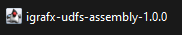

# iGrafx Kafka Modules

[](https://scala-lang.org/)
[](https://scala-lang.org/)
[](https://github.com/ellerbrock/open-source-badges/)
[](https://github.com/igrafx/miningkafka/blob/master/LICENSE)

[](https://github.com/igrafx/miningkafka/forks)

[](http://www.repostatus.org/#active)


***

## Introduction

Welcome to the **iGrafx Kafka Modules**!

The **iGrafx Kafka Modules** are open-source tools designed to integrate seamlessly with Kafka, enabling efficient data streaming, transformation, and analysis. 
These modules empower you to use data, enrich their streams, and send real-time insights to the iGrafx Mining platform.

Built for flexibility and performance, these modules include the **Docker Compose**, **iGrafx Connectors**, and **iGrafx UDFs (User-Defined Functions)**, 
offering a complete solution for modern data streaming and analytics workflows.

The **[Docker Compose](https://github.com/igrafx/miningkafka/blob/master/howto.md#docker-compose)** module provides a Kafka infrastructure setup located in the docker-compose/ subdirectory. It includes essential components for managing and interacting with Kafka

In the **iGrafx Connectors** module, you will find 2 connectors.

- The **[iGrafx Aggregation Connector](https://github.com/igrafx/miningkafka/blob/master/howto.md#igrafx-aggregation)** allows you to aggregate multiple records originating from the same partition into a single, structured array.
- The **[iGrafx Aggregation and Sink Connector](https://github.com/igrafx/miningkafka/blob/master/howto.md#igrafx-aggregation-main-aggregation-and-igrafx-sink-connector)** allows you to aggregate and send data from Kafka to the iGrafx Mining platform.

In the **iGrafx UDFs** module, you will find 3 UDFs.

- The **[iGrafx Case Events UDF](https://github.com/igrafx/miningkafka/blob/master/howto.md#igrafx-case-events-udf)**  retrieves detailed information related to specific case IDs within Druid.
- The **[iGrafx Sessions UDF](https://github.com/igrafx/miningkafka/blob/master/howto.md#igrafx-sessions-udf)**  takes a collection of lines and organizes them into separate sessions.Each session groups related events.
- The **[iGrafx Transposition UDF](https://github.com/igrafx/miningkafka/blob/master/howto.md#igrafx-transposition-udf)**  transforms a single row containing multiple dates, each associated with specific activities, into multiple rows—each with a single date (or period) linked to its corresponding activity.

A detailed tutorial can be found in the [howto.md](https://github.com/igrafx/miningkafka/blob/dev/howto.md) file.

To begin with ksqlDB and Kafka, you may follow these links:

- [Main documentation](https://docs.confluent.io/platform/current/ksqldb/overview.html)
- [ksqlDB Tutorials](https://docs.confluent.io/platform/current/ksqldb/tutorials/overview.html)
- [Video Courses](https://developer.confluent.io/courses/#fundamentals)
- [Confluent Developer](https://developer.confluent.io/)

### Key Features

- **Streamlined Integration**: Connect, process, and deliver data effortlessly to the iGrafx Mining platform using Kafka.
- **Powerful Customization**: Define and deploy custom UDFs tailored to your specific data transformation needs.
- **Real-Time Data Processing**: Enable live connections for seamless, real-time analytics and decision-making.
- **Open-Source**: Freely use and adapt these modules to meet your requirements.

> **Note:** An iGrafx account is required to fully utilize these modules. For account setup, please contact [iGrafx Support](https://www.igrafx.com/).

Explore the repository and get started [here](https://github.com/igrafx/miningkafka/blob/master/howto.md).

You may also explore other iGrafx opensource projects such as the [iGrafx Mining SDK](https://github.com/igrafx/mining-python-sdk) or the [iGrafx KNIME Mining Extension](https://github.com/igrafx/KNIME-Mining-connector).

## Quickstart

This Quickstart guide provides step-by-step instructions for getting into the iGrafx Kafka Modules. 
You will learn how to clone the repository, launch **Docker Compose**, 
interact with the **ksqlDB CLI** and **Kafka UI**, and configure **iGrafx Connectors** and **User Defined Functions (UDFs)**.
Each component can be run locally, giving you flexibility for testing and development.

By following these steps, you can set up and use iGrafx Kafka Modules, manage data streams and transformations, and enhance your workflows with connectors and UDFs.

### Step 1: Clone the Repository

Clone the iGrafx Kafka Modules repository to your local machine:
```
git clone https://github.com/igrafx/miningkafka.git
```
Ensure you have Docker and Docker Compose installed on your system.
Follow these links for installation instructions:
- [Docker](https://docs.docker.com/get-started/get-docker/)
- [Docker Compose](https://docs.docker.com/compose/install/)

### Step 2: Launch Docker Compose
This module provides a Kafka infrastructure setup located in the `docker-compose/` subdirectory. 
It includes essential components for managing and interacting with Kafka.
#### Starting the infrastructure

1. Navigate to the docker compose directory:
```
cd docker-compose/
````

2. Start the infrastructure with the following command:
``` bash
make start
```

#### Stopping Docker Compose

To stop **Docker Compose** run the following command:
```bash
make stop
```

#### Cleaning Up

If you want to remove all the streams, tables or connectors and delete the data you inserted during your tests,
you can delete the ``/data`` folder that is in the ``/docker-compose`` directory.


### Step 3: Use the ksqlDB CLI and Kafka UI

> You can use either the **ksqlDB CLI** or the **Kafka UI** to interact with your cluster. It all depends on what you desire:
> - **ksqlDB CLI**: Ideal for executing ksql queries, managing streams, tables, and connectors programmatically, and debugging directly from the terminal.
> - **Kafka UI**: Provides a graphical interface for visualizing your Kafka cluster, inspecting topics, monitoring pipelines, and managing configurations with ease.
>
> Choose the tool that best fits your workflow or combine both for maximum flexibility!

#### Access the ksqlDB CLI

1. With the infrastructure running, type the following command from `/docker-compose` in a terminal to connect to the CLI:
````bash
docker-compose exec ksqldb-cli ksql http://ksqldb-server:8088
````
2. Using the CLI, you can send ksql commands, and you can quit it by typing ``exit``.

>If you are unfamiliar with ksqlDB, you may follow these links:
>
>  - [Lexical Structure](https://docs.confluent.io/platform/current/ksqldb/reference/sql/lexical-structure.html#ksqldb-lexical-structure)
>  - [API Index](https://docs.confluent.io/platform/current/ksqldb/developer-guide/ksqldb-reference/overview.html#ksqldb-api-index)

#### Access the Kafka UI

**Kafka UI** is a user interface you can use to get information about your kafka cluster,
the topics, the ksql pipelines you created and more.

1. Open your browser and navigate to http://localhost:9021/ to access the Kafka UI.

2. Use the credentials from the `docker-compose.yml`, located in the `/docker-compose` directory under the `JAVA_OPTS` variable:

!
   - `Dspring.security.user.name` represents the username.
   - `Dspring.security.user.password` represents the password.

If you wish to change the credentials, you can do so by editing the `docker-compose.yml` file in the `/docker-compose` directory.
to do so, replace the `admin` value of the `Dspring.security.user.name` and `Dspring.security.user.password` variables with your desired credentials.

>If you are unfamiliar with Kafka UI, you may follow these links:
>
> - [About Kafka UI](https://docs.kafka-ui.provectus.io/)
> - [Video Courses](https://developer.confluent.io/courses/#fundamentals)


### Step 4: Retrieve JAR Files from the Latest Release

To utilize the iGrafx Connectors and UDFs, you need the corresponding JAR files. There are two ways to obtain these files:

1. **Build the JAR Files Yourself**: Follow the instructions provided in the subsequent sections to build the JAR files manually.
2. **Retrieve JAR Files from the latest Release**: You can directly download the JAR files from the latest release in the
   iGrafx Kafka Modules GitHub Project.

To retrieve the JAR files of the iGrafx Connectors and UDFs from the latest release, follow these steps:

1. Navigate to the **[Release Section](https://github.com/igrafx/miningkafka/releases)** in the homepage of the GitHub repository.
2. Make sure you are on the latest release. The latest release is indicated by the **green label** marked `Latest` next to the release number, as shown in the screenshot below:

   

3. In the `assets` section, you will find 2 zip files, one for the **Connectors** and one for the **UDFs**.

   

4. Click on **igrafx-connectors-artifacts.zip** or **igrafx-udfs-artifacts.zip** (or both if needed).
   This will download a **ZIP file** containing the **JAR files**.

5. Here is what you will find in the **`igrafx-connectors-artifacts.zip`**:
   

6. Here is what you will find in the **`igrafx-udfs-artifacts.zip`**:
   

7. Once downloaded, extract the desired JAR files:
- Place the **Connectors JAR files** in the `docker-compose/connect-plugins/` directory of the **Docker Compose** module. This allows them to be used in the **ksqlDB CLI**.


- For **UDFs JAR files**, place them in the `docker-compose/extensions/` directory of the **Docker Compose** module. If this directory does not exist, create it.

By following these steps, you can easily retrieve and configure the required JAR files for iGrafx Connectors and UDFs.

### Step 5: Set Up iGrafx Connectors

The **iGrafx Kafka Connectors** module provides connectors specifically designed to streamline data flow in and out of Kafka. These connectors enable seamless integration with various data sources and destinations, allowing users to effortlessly move data into Kafka for analysis or export it for further processing.

There are 2 existing connectors in the **iGrafx Kafka Connectors** module:

- **iGrafx Aggregation** : aggregates Kafka records from a same partition.
- **iGrafx Aggregation Main** : aggregates Kafka records from a same partition and send the aggregation result to the iGrafx Mining API.

#### Build and configure iGrafx Connectors
>If you have already retrieved JARS from the CI/CD pipelines, you can skip this section.

1. To use the iGrafx Connectors to send data from Kafka to the Process360 Live,
you must  go to the ``igrafx-connectors`` directory as follows:

```bash
cd igrafx-connectors/
```
2. Now, build the desired JAR file using the following command:

```
sbt aggregationMain/assembly
````
Once the **JAR** is created, you can find it in the ``/igrafx-connectors/artifacts`` repository.
Copy the latest **JAR** and paste it in the ``/docker-compose/connect-plugins/`` directory of the Docker Compose module.

Now, by relaunching the docker compose with the ``make start`` command, you will now be able to use the connector in ksql.

#### Monitor Connectors

1. To check the status of the connectors you created, use the following command in the **ksqlDB CLI**:

````sql
SHOW CONNECTORS;
````
Finally, if one connector has a ``FAILED`` state, you can check the logs in ``Kafka-connect`` by using the following command from the ``/docker-compose`` directory in the Docker Compose module :
````bash
docker-compose logs -f connect
````

### Step 6: Set Up iGrafx UDFs

UDFs (User Defined Functions) are useful for applying custom transformations to each value in a specific column of a stream.
The **iGrafx UDFs** module offers a set of User-Defined Functions (UDFs) specifically designed to enhance data transformation and analysis within the Kafka ecosystem.
You can create custom UDFs and integrate them into the environment, making them available for use in data pipelines to enhance processing and transformation capabilities.

There are 3 existing UDFs in the **iGrafx UDFs** module:
- The **[iGrafx Case Events UDF](https://github.com/igrafx/miningkafka/blob/master/howto.md#igrafx-case-events-udf)**  retrieves detailed information related to specific case IDs within Druid.
- The **[iGrafx Sessions UDF](https://github.com/igrafx/miningkafka/blob/master/howto.md#igrafx-sessions-udf)**  takes a collection of lines and organizes them into separate sessions.Each session groups related events.
- The **[iGrafx Transposition UDF](https://github.com/igrafx/miningkafka/blob/master/howto.md#igrafx-transposition-udf)**  transforms a single row containing multiple dates, each associated with specific activities, into multiple rows—each with a single date (or period) linked to its corresponding activity.


#### Build and configure UDFs
>If you have already retrieved JARS from the CI/CD pipelines, you can skip this section.

1. To use the iGrafx UDFs, you must first go to the ``igrafx-udfs`` directory as follows:

```bash
cd igrafx-udfs/
```
2. Build the desired JAR file containing all the UDFs using the following command:

```bash
sbt assembly
```
Once the **JAR** is created, you can find it in the ``/igrafx-udfs/target/scala-2.13`` repository.
Copy the latest **JAR** and paste it in the ``/docker-compose/extensions/`` directory of the Docker Compose module.
If this directory doesn't exist, you can create it.

Now, by relaunching the infrastructure with the ``make start`` command, you will now be able to use the UDFs in ksql.

#### Explore UDFs
1. To display a list of available UDFs using the following command in the **ksqlDB CLI**:

````sql
SHOW FUNCTIONS;
````
2. To check the documentation of a given UDF by using the following command:

````sql
DESCRIBE FUNCTION <UDF_NAME>;
````
Where <UDF_NAME> is the name of the UDF you want to check the documentation of.

## Documentation

The full documentation can be found in the ```howto.md``` file [here](https://github.com/igrafx/miningkafka/blob/dev/howto.md).
Follow the instructions to try out the modules.

You may directly refer to examples in the [howto.md](https://github.com/igrafx/miningkafka/blob/dev/howto.md#examples) file.


## Contributing

Pull requests are welcome. For major changes, please open an issue first to discuss what you would like to change.

Please make sure to update tests as appropriate.

For more information on how to contribute, please see the [CONTRIBUTING.md](https://github.com/igrafx/miningkafka/blob/dev/CONTRIBUTING.md) file.

## Support

Support is available at the following address: [support@igrafx.com](mailto:support@igrafx.com).

## Notice

Your feedback and contributions are important to us. Don't hesitate to contribute to the project.

## License

These iGrafx Kafka Modules is licensed under the MIT License. See the [LICENSE](https://github.com/igrafx/miningkafka/blob/dev/LICENSE) file for more details.