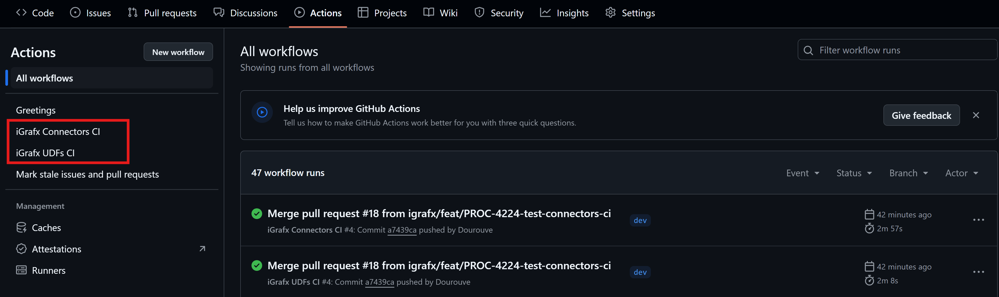
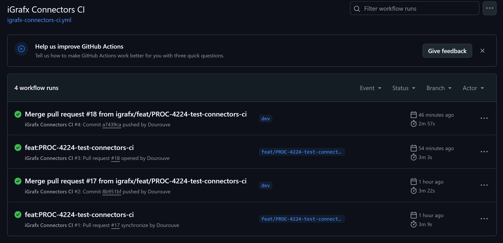
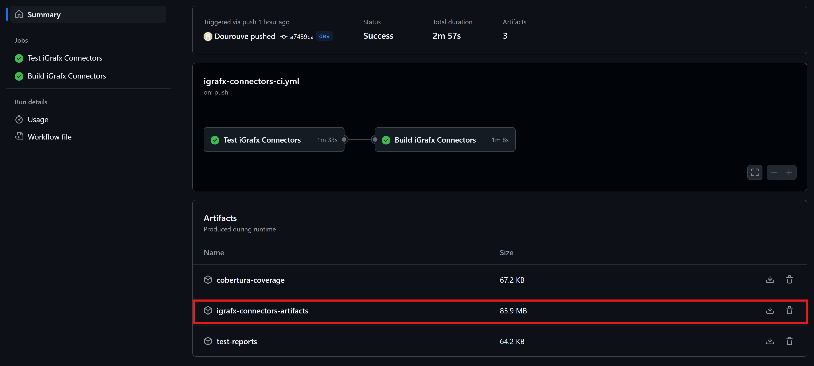
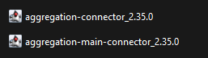
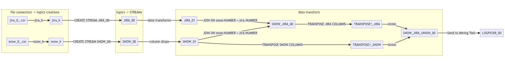

# How to Use the iGrafx Kafka Modules

This document provides guidance on installing and using the **iGrafx Kafka Modules**, which include the **iGrafx LiveConnect**, **iGrafx Connectors**, and **iGrafx UDFs**. It also offers examples and best practices for integrating with your Kafka environment.

The **iGrafx Kafka Modules** are open-source applications designed to enhance your data streaming and integration workflows.
These modules enable real-time data processing and transformation, allowing you to connect, enrich, and analyze data and send it to the iGrafx Mining platforms.

Using these modules, you can configure kafka connectors, define custom UDFs (User-Defined Functions), and enable live connections for seamless data streaming and analysis.

Please note that an iGrafx account is required to fully utilize these modules. For account setup, please contact iGrafx support.

Find the GitHub repository for the iGrafx Kafka Modules [here](https://github.com/igrafx/miningkafka).

***

## Table of Contents

- [Quickstart](#quickstart)
  - [iGrafx Liveconnect: Quickstart](#igrafx-liveconnect-quickstart)
  - [ksqlDB CLI and Kafka UI: Quickstart](#ksqldb-cli-and-kafka-ui-quickstart)
  - [Getting the JAR builds from the CI/CD pipelines](#getting-the-jar-builds-from-the-cicd-pipelines)
  - [iGrafx Connectors: Quickstart](#igrafx-connectors-quickstart)
  - [iGrafx UDFs: Quickstart](#igrafx-udfs-quickstart)

- [iGrafx Liveconnect](#igrafx-liveconnect)
  - [Requirements](#requirements)
  - [Launching Liveconnect](#launching-liveconnect)
  - [Installing New Connectors](#installing-new-connectors)
  - [Recommended Connectors](#recommended-connectors)
  - [Configuration for a Specific Kafka Topic](#configuration-for-a-specific-kafka-topic)
  - [Example Configuration for Cross-VM Communication](#example-configuration-for-cross-vm-communication)
  - [Data-Transform Database](#data-transform-database)
  - [SFTP Server Configuration](#sftp-server-configuration)
  - [Connecting to the SFTP Server](#connecting-to-the-sftp-server)

- [Kafka-UI](#kafka-ui)

- [ksqlDB CLI Console](#ksqldb-cli-console)

- [iGrafx Kafka Connectors](#igrafx-kafka-connectors)
  - [iGrafx Aggregation](#igrafx-aggregation)
    - [Connector Properties](#connector-properties)
    - [AVRO](#avro)
    - [Maximum Message Size](#maximum-message-size)
  - [iGrafx Aggregation Main (Aggregation and iGrafx Sink Connector)](#igrafx-aggregation-main-aggregation-and-igrafx-sink-connector)
    - [Connector Properties](#connector-properties-1)
      - [Mandatory Properties](#mandatory-properties)
      - [Optional Properties](#optional-properties)
    - [AVRO](#avro-1)
    - [iGrafx API](#igrafx-api)
    - [Kafka Logging Events](#kafka-logging-events)

  - [Connector Commonalities](#connector-commonalities)
    - [Offset Management](#offset-management)
    - [Retention](#retention)
    - [Error Handling](#error-handling)
    - [Compilation and Deployment on LiveConnect](#compilation-and-deployment-on-liveconnect)
    - [Creating and Adding a New Connector](#creating-and-adding-a-new-connector)
    - [Connector Monitoring](#connector-monitoring)

- [iGrafx UDFs](#igrafx-udfs)
  - [iGrafx Case Events UDF](#igrafx-case-events-udf)
    - [Overview](#overview)
    - [UDF Signature and Output Format](#udf-signature-and-output-format)
  - [iGrafx Sessions UDF](#igrafx-sessions-udf)
    - [Overview](#overview-1)
    - [UDF Signature and Output Format](#udf-signature-and-output-format-1)
  - [iGrafx Transposition UDF](#igrafx-transposition-udf)
    - [Overview](#overview-2)
    - [Variation 1](#variation-1)
    - [Variation 2](#variation-2)
  - [Compilation and Deployment on LiveConnect](#compilation-and-deployment-on-liveconnect-1)

- [Examples](#examples)
  - [Basic ksqlDB Example](#basic-ksqldb-example)
  - [Basic iGrafx Connector Example](#basic-igrafx-connector-example)
  - [Full Data Pipeline Example](#full-data-pipeline-example)
    - [Data Pipeline Overview](#data-pipeline-overview)
    - [Source Files](#source-files)
    - [Connectors and UDF Installation](#connectors-and-udf-installation)
    - [Connector for Process Mining Platform](#connector-for-process-mining-platform)
    - [Connector for CSV Files](#connector-for-csv-files)
    - [Custom UDFs](#custom-udfs)
  - [1. Source Connectors](#1-source-connectors)
  - [2. Streams and Data Transformation](#2-streams-and-data-transformation)
  - [3. Sending Data to the iGrafx Mining Platform](#3-sending-data-to-the-igrafx-mining-platform)
  - [Aggregation Connector Examples](#aggregation-connector-examples)
    - [Example 1](#example-1)
    - [Example 2](#example-2)
  - [Grouped Tasks Example with the AggregationMain Connector](#grouped-tasks-example-with-the-aggregationmain-connector)
  - [Example Using the Case Events UDF](#example-using-the-case-events-udf)
  - [Example Using the Sessions UDF](#example-using-the-sessions-udf)
  - [Examples Using the Transpositions UDFs](#examples-using-the-transpositions-udfs-)
    - [Variation 1](#variation-1-1)
    - [Variation 2](#variation-2-1)
    - [3rd UDF Example](#3rd-udf-example)

- [Further Documentation](#further-documentation)


## Quickstart

This Quickstart guide covers setting up iGrafx Kafka Modules, 
from cloning the repository to managing data streams and transformations. 
It includes instructions for configuring **LiveConnect**, 
using the **ksqlDB CLI** and **Kafka UI** to manage topics and connectors, 
setting up **iGrafx Connectors** for streaming data, and implementing **User Defined Functions (UDFs)** for custom data transformations. 
Each component can be run locally, giving you flexibility for testing and development.


To use the iGrafx Kafka Modules, first, clone the repository:

```
git clone https://github.com/igrafx/miningkafka.git
```
Then, make sure you have Docker and Docker Compose installed on your system. 
Follow these links for installation instructions:
- [Docker](https://docs.docker.com/get-started/get-docker/)
- [Docker Compose](https://docs.docker.com/compose/install/)

### iGrafx Liveconnect: Quickstart

To launch **LiveConnect** run the following command:
```
cd igrafx-liveconnect/docker-compose/
make liveconnect
````

To stop **LiveConnect** run the following command:
```
make liveconnect-down
```
Furthermore, if you want to remove all the streams, tables or connectors and delete the data you inserted during your tests, 
you can delete the ``/data`` folder that is in the ``/docker-compose`` directory.


### ksqlDB CLI and Kafka UI: Quickstart
With liveconnect running, you can now connect to the **ksqlDB CLI** that will allow you to send the desired commands.

Type the following command from /docker-compose in a terminal to connect to the CLI:
````bash
docker-compose exec ksqldb-cli ksql http://ksqldb-server:8088
````
Once in the CLI, you can send ksql commands, and you can quit it by typing ``exit``.

Moreover, Kafka UI is a user interface you can use to get information about your kafka cluster, 
the topics, the ksql pipelines you created and more.

You can then access it at http://localhost:9021/.

The credentials for Kafka UI are set in the ``docker-compose.yml`` file, within the ``JAVA_OPTS`` variable.
``-Dspring.security.user.name`` is the username and ``-Dspring.security.user.password`` is the password.

### Getting the JAR builds from the CI/CD pipelines

To utilize the iGrafx Connectors and UDFs, you need the corresponding JAR files. There are two ways to obtain these files:

1. **Build the JAR Files Yourself**: Follow the instructions provided in the subsequent sections to build the JAR files manually.
2. **Retrieve JAR Files from the CI/CD Pipelines**: You can directly download the JAR files from the CI/CD pipelines in the iGrafx GitHub Project.

To retrieve the JAR files from the CI/CD pipelines, follow these steps:

1. Navigate to the **[Actions tab](https://github.com/igrafx/miningkafka/actions)** in the GitHub repository.
2. In the left sidebar, select the workflow of interest: **iGrafx Connectors** or **UDFs**, as shown below:

   

3. Click on the workflow name to access the workflow runs. For this example, we will focus on the **iGrafx Connectors** workflow.
  - Click on **iGrafx Connectors CI**. This will take you to the workflow runs page:

    

4. Select the most recent successful run (indicated by a **green checkmark**). You will arrive at a page similar to this:

   

5. Locate and click on **igrafx-connectors-artifacts** (or **igrafx-udfs-artifacts** for the UDFs workflow) to download a ZIP file containing the JAR files.

6. Once downloaded, extract the desired JAR files:
  - Place the **Connectors JAR files** in the `igrafx-liveconnect/docker-compose/connect-plugins/` directory of the **iGrafx Liveconnect** module. This allows them to be used in the **ksqlDB CLI**.

    

  - For **UDFs JAR files**, place them in the `igrafx-liveconnect/docker-compose/extensions/` directory of the **iGrafx Liveconnect** module. If this directory does not exist, create it.

By following these steps, you can easily retrieve and configure the required JAR files for iGrafx Connectors and UDFs.

### iGrafx Connectors: Quickstart
If you want to use the iGrafx Connectors to send data from Kafka to the Process360 Live, 
you must  go to the ``igrafx-connectors`` directory as follows:

```bash
cd igrafx-connectors/
```
Then, you can build the desired JAR file using the following command:

```
sbt aggregationMain/assembly
````
Once the **JAR** is created, you can find it in the ``/igrafx-connectors/artifacts`` repository. 
Copy the latest **JAR** and paste it in the ``/docker-compose/connect-plugins/`` directory of the iGrafx Liveconnect module.

Now, by relaunching Liveconnect with the ``make liveconnect`` command, you will now be able to use the connector in ksql.

Furthermore, if you wish to check the status of the connectors you created, use the following command in the **ksqlDB CLI**:

````sql
SHOW CONNECTORS;
````
Finally, if one connector has a ``FAILED`` state, you can check the logs in ``Kafka-connect`` by using the following command from the ``/docker-compose`` directory in the Liveconnect module :
````bash
docker-compose logs -f connect
````

### iGrafx UDFs: Quickstart
UDFs (User Defined Functions) are useful for applying custom transformations to each value in a specific column of a stream.

You can create custom UDFs and integrate them into LiveConnect, making them available for use in data pipelines to enhance processing and transformation capabilities.

If you want to use the iGrafx UDFs, you must first go to the ``igrafx-udfs`` directory as follows:

```bash
cd igrafx-udfs/
```
Then, you can build the desired JAR file containing all the UDFs using the following command:

```bash
sbt assembly
```
Once the **JAR** is created, you can find it in the ``/igrafx-udfs/target/scala-2.13`` repository. 
Copy the latest **JAR** and paste it in the ``/docker-compose/extensions/`` directory of the iGrafx Liveconnect module. 
If this directory doesn't exist, you can create it.

Now, by relaunching Liveconnect with the ``make liveconnect`` command, you will now be able to use the UDFs in ksql.

Moreover, you can display a list of available UDFs using the following command in the **ksqlDB CLI**:


````sql
SHOW FUNCTIONS;
````
You can also check the documentation of a given UDF by using the following command:

````sql
DESCRIBE FUNCTION <UDF_NAME>;
````
Where <UDF_NAME> is the name of the UDF you want to check the documentation of.

## iGrafx Liveconnect:

This module provides a Kafka infrastructure setup located in the `docker-compose/` subdirectory. It includes essential components for managing and interacting with Kafka and optional tools for extended functionality:

- **Broker and Zookeeper**: Core components for managing Kafka topics and messages.
- **Schema Registry**: Service for registering schemas on Kafka topics.
- **Kafka Connect (Connect)**: Supports Kafka Connect connectors for data integration.
- **ksqlDB and CLI**: Enables stream processing and querying of Kafka topics.
- **Kafka UI (or Confluent Control Center)**: A graphical interface for monitoring and managing Kafka cluster functionalities.
- **SFTP Server** *(optional)*
- **PostgreSQL Database** *(optional)*: For auxiliary processing.

### Requirements

To use the LiveConnect module, you must have Docker and Docker Compose installed on your system. Follow these links for installation instructions:

- [Install Docker](https://docs.docker.com/get-docker/)
- [Install Docker Compose](https://docs.docker.com/compose/install/)

### Launching Liveconnect

The containers within this infrastructure communicate through the internal Docker network, `kafka-network`.

**To launch **LiveConnect** (Dockerized Kafka infrastructure):**
```
cd docker-compose/
make liveconnect
```

**To stop the LiveConnect infrastructure:**
```
cd docker-compose/
make liveconnect-down
```
### Installing New Connectors

To add a Kafka connector, place it in the `docker-compose/connect-plugins/` directory, as referenced by the `CONNECT_PLUGIN_PATH` variable in the `docker-compose.yml`.

You can easily find and install a new connector using the [Confluent Hub Client](https://docs.confluent.io/home/connect/confluent-hub/client.html).
When doing so, make sure you download the latest version of the connector.

To do so, you must *manually* copy a directory with the required JAR files and configurations into the designated connectors directory (`connect-plugins` in our setup).
After adding a new connector, restart the `liveconnect` Docker container with the ``make liveconnect`` command.

There are numerous Kafka connectors, including many from the [Camel Kafka ecosystem](https://camel.apache.org/camel-kafka-connector/latest/).
You may look for them in the [Maven repository](https://mvnrepository.com/) and directly download a **jar** or a **targz** as per your preference.
You then have to place the **JAR** in the `docker-compose/connect-plugins/` directory.

### Recommended Connectors

Below are the installation commands for the recommended connectors:

- **[File System Source Connector](https://www.confluent.io/hub/jcustenborder/kafka-connect-spooldir)**: For loading files in formats such as CSV, JSON, etc.


- **[JDBC Connector (Source and Sink)](https://www.confluent.io/hub/confluentinc/kafka-connect-jdbc)**: For connecting to JDBC-compatible databases.


- **[iGrafx Sink Connector](#igrafx-aggregation-main-aggregation-and-igrafx-sink-connector)**: For sending data from Kafka topics to an iGrafx project.

  You have two options to install the iGrafx Sink connector:
  1. **Build the Connector Jar**: Follow the instructions in the [iGrafx Connectors section](#compilation-and-deployment-on-liveconnect) to build the connector JAR.
  2. **Retrieve the Connector Jar from the pipeline**.

> Note that you may also download the iGrafx UDFs by following [similar commands](#igrafx-udfs).


### Configuration for a Specific Kafka Topic

The `igrafx-liveconnect` template can be deployed on a separate VM from the main application.

However, to ensure proper communication, the Kafka registry and broker associated with the topic must be accessible to the `api` container of the target application. This requires opening the registry and Kafka broker ports on the VM host where they are installed and confirming that the host is reachable from the `api` service.

To set up a workgroup with LiveConnect:

- **Set the Workgroup ID:** Define the workgroup ID in the `.env` file under `WORKGROUP_ID`.
- **Configure Kafka Connection in Database:** In the `WORKGROUPS` table in PostgreSQL, update the `KAFKA_BROKER` and `KAFKA_REGISTRY` columns with the appropriate URLs. For example:
  - `KAFKA_BROKER`: `http://kafka-broker:29092`
  - `KAFKA_REGISTRY`: `http://schema-registry:8081`

### Example Configuration for Cross-VM Communication

If the VMs are on the same private network and ports have been opened on the LiveConnect VM, you can configure the `WORKGROUPS` table as follows:

- **Kafka Broker URL:** Set `KAFKA_BROKER` to `http://192.168.1.128:19092`
- **Kafka Registry URL:** Set `KAFKA_REGISTRY` to `http://192.168.1.128:8081`

Once configured, the workgroup administrator can activate the Kafka topic, allowing the topic to receive updates on all cases in a project during project updates.


### Data-Transform Database

A PostgreSQL database is available to perform data transformations that are not yet supported in ksqlDB. This setup allows you to add additional columns or perform advanced processing on data before it's ingested back into Kafka.

The following example demonstrates how to use an intermediate PostgreSQL database to generate an additional column `cnt`, which numbers events within each case (identified here by the `INCIDENT` column).

#### Step 1: Create a Table with Auto-Increment Index `id`

The auto-increment `id` index allows the ksqlDB connector to continuously retrieve the latest data. If available, other fields (such as timestamp or unique event identifier) can also serve this purpose.

> **Note:** This table can be set up to create automatically on initial launch (see `conf/pg-initdb.d/`).

Example command to create the table in your local PostgreSQL instance (accessible on the default port, with connection details in the `.env` file):

```sql
CREATE TABLE public."JDBC_TABLE" (
  id SERIAL PRIMARY KEY NOT NULL
);
```
#### Step 2: Feed the Table from a Kafka Topic Using a JDBC Sink Connector
The following JDBC sink connector populates the PostgreSQL ``JDBC_TABLE`` table from the ``JDBC_TABLE`` Kafka topic:

``` 
CREATE SINK CONNECTOR JDBC_SINK_01 WITH (
  'connector.class'          = 'io.confluent.connect.jdbc.JdbcSinkConnector',
  'key.converter'             = 'org.apache.kafka.connect.storage.StringConverter',
  'topics'                         = 'JDBC_TABLE',
  'table.name.format'     = 'JDBC_TABLE',
  'connection.url'           = 'jdbc:postgresql://data-transform:5432/transform?verifyServerCertificate=false',
  'connection.user'          = 'datamanager',
  'connection.password'      = '1r8P!eXx',
  'auto.evolve'              = 'true'
);
```

#### Step 3: Read Data from the Table Using a JDBC Source Connector
The following JDBC source connector reads data from the PostgreSQL table and includes a generated ``cnt`` column that assigns sequential numbers to events within each ``INCIDENT`` case.
The ``query`` parameter in the connector specifies this transformation:
``` 
CREATE SOURCE CONNECTOR JDBCSOURCEConnector1 WITH (
    'connector.class' = 'io.confluent.connect.jdbc.JdbcSourceConnector',
    'tasks.max' = '1',
  'connection.url'           = 'jdbc:postgresql://data-transform:5432/transform?verifyServerCertificate=false',
  'connection.user'          = 'datamanager',
  'connection.password'      = '1r8P!eXx',
    'mode' = 'incrementing',
    'incrementing.column.name' = 'id',
    'numeric.mapping' = 'best_fit',
    'topic.prefix' = 'jdbc_cnt_case_lines',
    'query' = 'SELECT * , ROW_NUMBER() OVER(PARTITION BY INCIDENT ORDER BY id ASC) as cnt from JDBC_TABLE'
);
```

### SFTP Server Configuration

An SFTP server may be necessary to allow users to regularly upload CSV files for data updates.
A pre-configured SFTP server is included in the `docker-compose` setup, using the [corilus/sftp container](https://hub.docker.com/r/corilus/sftp).

Furthermore, the `docker-compose.yml` file provides options to configure:
- **SFTP User and Password:** Define the username and password for accessing the SFTP server.
- **File Directory and UID:** Specify the local directory where uploaded files will be stored, along with the user ID (UID) for permissions.
- **Local Port:** Set the port on which the SFTP server will be accessible.

Ensure that any directories or files uploaded via the SFTP server match the directory mounts used by the `connect` service in `docker-compose.yml`. This alignment is particularly important if changes or additional users are added, to maintain seamless file access between the `connect` and `sftp` containers.

### Connecting to the SFTP Server

To connect to the SFTP server using the default user `foo`, you can use an SFTP client such as **FileZilla** or **WinSCP**. Connect to `localhost` on the port specified in the `docker-compose` file (default is `2222`).

- **Username:** `foo`
- **Password:** Use the password defined in `docker-compose.yml`
- **Directory:** Upload files to the directory specified in `docker-compose.yml`

You can connect via command line:

```bash
sftp -P 2222 foo@<host-ip>
```

## Kafka-UI

Kafka-UI is a user-friendly graphical interface for managing and interacting with a Kafka/KSQLDB cluster.
It allows you to view Kafka topic messages, manage connectors, run ksqlDB queries, and monitor various aspects of your Kafka cluster's performance.

To log in, use the username and password defined in the `docker-compose.yml` file under the `kafka-ui` section.
These credentials are configured via the `JAVA_OPTS` variable, where `-Dspring.security.user.name` specifies the username and `-Dspring.security.user.password` sets the password.

You can also access Kafka-UI locally by navigating to [http://localhost:9021](http://localhost:9021).


## ksqlDB CLI Console
The ksqlDB CLI provides command-line access for managing KSQL commands, viewing connectors, topics, streams, tables, and more.

To access the ksqlDB CLI, use the following command:
```bash
docker-compose exec ksqldb-cli ksql http://ksqldb-server:8088
```

Once inside the ksqlDB CLI prompt, you can set environment-specific variables as needed. For example, to configure the offset setting, use:
``` 
SET 'auto.offset.reset' = 'earliest';
```
This command sets the offset to the earliest, ensuring that the CLI reads from the beginning of each topic.

To quit the ksqlDB CLI, type `exit` and press enter.

For further information on ksqlDB CLI configuration, please refer to the documentation at [click here](https://docs.ksqldb.io/en/latest/operate-and-deploy/installation/cli-config/).

For further documentation on ksqlDB, please refer to the documentation at [click here](https://ksqldb.io/).


## iGrafx Kafka Connectors:

The **iGrafx Kafka Connectors** module provides connectors specifically designed to streamline data flow in and out of Kafka. These connectors enable seamless integration with various data sources and destinations, allowing users to effortlessly move data into Kafka for analysis or export it for further processing.

There are 2 existing connectors in the **iGrafx Kafka Connectors** module:

- **iGrafx Aggregation** : aggregates Kafka records from a same partition.
- **iGrafx Aggregation Main** : aggregates Kafka records from a same partition and send the aggregation result to the iGrafx Mining API.

### iGrafx Aggregation:

* module : aggregation
* package : com.igrafx.kafka.sink.aggregation

This connector is designed to aggregate multiple records originating from the same partition into a single, structured array. For example, if the incoming data contains two columns with the following types:

 ``` 
 LINE1 VARCHAR,
 LINE2 VARCHAR
 ```

The result of the aggregation will be sent to a Kafka topic in the following format:

``` 
LINEAG ARRAY<STRUCT<LINE1 VARCHAR, LINE2 VARCHAR>>
```


Each record from Kafka will be aggregated with others in an array structure. 
In this case, **LINEAG** is used as the value for the `aggregationColumnName` connector property, defining the name of the aggregated column.

Here, the aggregation column:
``` 
LINEAG ARRAY<STRUCT<...>>
```

that is appended over the columns of the incoming data to represent the aggregation results. 
The **ARRAY** contains the different aggregated results, while the **STRUCT** preserves the various columns of the input data.

The aggregation is triggered based on several thresholds:

* **Element Number:** When the number of aggregated elements reaches a specified count, the aggregation result is sent to Kafka.
* **Value Pattern:** A regular expression (ReGex) pattern can be defined to flush the current aggregation to Kafka if an incoming sink record's value matches this pattern.
* **Timeout:** After a certain period since the last aggregation was sent, the current aggregated data is pushed to Kafka, even if the element count threshold hasn't been met.
* **Retention:** This threshold is governed by the **retention.ms** configuration in the source Kafka topic. It is not set by the user in the connector’s properties but can impact data retention within the aggregation window. See the Retention section below for more details.

>**Note**: The aggregation schema is obtained from the Kafka output topic specified by the **topicOut** property. Therefore, this topic’s schema must be created before any data is sent to the connector.


### Connector Properties

To set up the connector, specify the following properties (example values provided):


``` 
'connector.class' = 'com.igrafx.kafka.sink.aggregation.adapters.AggregationSinkConnector', 
'tasks.max' = '1',
'topics' = 'aggregation_input_topic',
'topicOut' = 'aggregation_output_topic',
'aggregationColumnName' = 'aggregationColumnNameTest',
'threshold.elementNumber' = '6',
'threshold.valuePattern' = '.*regex_example.*',
'threshold.timeoutInSeconds' = 3000,
'bootstrap.servers' = 'broker:29092',
'key.converter' = 'org.apache.kafka.connect.storage.StringConverter',
'value.converter' = 'io.confluent.connect.avro.AvroConverter',
'value.converter.schema.registry.url' = 'http://schema-registry:8081'
```

Certain properties should remain fixed:

* **connector.class** (String): Specifies the connector class to be used.
* **key.converter** (String): Defines the converter for Kafka record keys.
* **value.converter** (String): Defines the converter for Kafka record values.

The other properties can be customized based on your requirements:

* **tasks.max** (Int): Number of tasks to instantiate for this connector.
* **topics** (String): List of Kafka topics that contain the data to aggregate.
* **topicOut** (String): Kafka topic where aggregated results are contained.
* **aggregationColumnName**: Name of the column that stores the aggregation result in ksqlDB.
* **threshold.elementNumber** (Int): Maximum number of elements in a single aggregation batch; once reached, the aggregation is sent to **topicOut**.
* **threshold.valuePattern** (String): *Optional.* A regex pattern that, when matched by the incoming record’s value, triggers the aggregation to be published immediately to **topicOut**, regardless of the element count. If this property is not defined, this threshold will not apply. Note that the pattern will need to align with the format of the SinkRecord (e.g., JSON structure).
* **threshold.timeoutInSeconds** (Int): Maximum time (in seconds) since the last aggregation was sent; once exceeded, the current aggregation is pushed to **topicOut**, even if **threshold.elementNumber** is not met.
* **bootstrap.servers** (String): List of Kafka brokers.
* **value.converter.schema.registry.url**: URL for the Kafka Schema Registry.

For more information on regular expressions used in **threshold.valuePattern**, refer to [this regex guide](https://medium.com/factory-mind/regex-tutorial-a-simple-cheatsheet-by-examples-649dc1c3f285).

### AVRO

To maintain data type consistency during aggregation, the ksqlDB STREAMs (applied to both input and output topics) must use the **AVRO** format for their values.

The connector retrieves the AVRO schema associated with the output topic in ksqlDB via HTTP. It then adjusts the schema of incoming Kafka records to align with this output schema, ensuring compatibility and data integrity throughout the aggregation process.

### Maximum Message Size

Kafka imposes a default size limit for individual messages sent to a topic. By default, messages cannot exceed **1048588 bytes** in size.

However, this limit can be adjusted in the **docker-compose** file by modifying the following properties to accommodate larger message sizes. In this example, the maximum size is set to **20000000 bytes**; adjust this value based on your needs.

In the **broker** service, add:

```
KAFKA_MESSAGE_MAX_BYTES: 20000000
KAFKA_MAX_REQUEST_SIZE: 20000000
KAFKA_PRODUCER_MAX_REQUEST_SIZE: 20000000
KAFKA_REPLICA_FETCH_MAX_BYTES: 20000000
```

In the **connect** service, add :

``` 
CONNECT_PRODUCER_MAX_REQUEST_SIZE: 20000000
CONNECT_CONSUMER_MAX_PARTITION_FETCH_BYTES: 20000000
```

In the **ksqldb-server** service, add :

``` 
KSQL_OPTS: "-Dmax.request.size=20000000"
```


> **Note**: Adjusting message sizes beyond the default may negatively impact Kafka performance. Large messages often require a dedicated Kafka cluster, separate from clusters handling regular data, to manage these configurations efficiently.

**Important:** The connector relies on the **max.message.bytes** configuration of the output Kafka topic to determine the maximum allowable message size for aggregation results.

If an aggregation exceeds the size set by **max.message.bytes**, the connector will divide the aggregation into multiple messages. For instance, if **max.message.bytes** is set to 1000000 bytes, and the aggregation size is 1500000 bytes, the connector will split the aggregation, sending two messages: one of approximately 900000 bytes (leaving a buffer) and another of 600000 bytes.


### iGrafx Aggregation Main (Aggregation and iGrafx Sink Connector)

* module : aggregationMain
* package : com.igrafx.kafka.sink.aggregationmain

This connector leverages the aggregation capabilities of the standard aggregation connector (explained in the last section) to combine multiple events, but it also sends the aggregation results directly to the iGrafx Mining API. Typically, before sending data to the iGrafx Mining API, multiple records representing process events are aggregated together, formatted into a CSV file, and then transmitted to the API. The Aggregation iGrafx Sink Connector automates this process.

Using this connector, events are pulled from Kafka, aggregated, and sent as a file to the iGrafx Mining API when a specified threshold is reached per partition. Unlike the standard aggregation connector, this module is dedicated to iGrafx data handling and bypasses Kafka’s message size limitations since the data destination is not a Kafka topic.

Additionally, the connector allows for creating column mappings for an iGrafx project directly from the connector, and it can also send log events to a Kafka topic.

The connector performs aggregations based on four thresholds:

* **Element Number**: When the aggregation reaches a specified number of elements, the result is sent to the iGrafx Mining API.
* **Value Pattern**: A regex pattern can be defined to flush the current aggregation to the iGrafx Mining API if the value of an incoming sink record matches the pattern.
* **Timeout**: If a specified amount of time has elapsed since the last aggregation result was sent, the current aggregated data is sent (regardless of the element number threshold).
* **Retention**: This threshold is not user-defined but is based on the **retention.ms** configuration of the Kafka topic from which data originates. For more details, see the retention section below.

### Connector properties

To instantiate the connector, we just have to fill in the following properties :

```
connector.class = "com.igrafx.kafka.sink.main.domain.IGrafxAggregationSinkConnector",
tasks.max = "1",
topics = "igrafx_topic_example",
api.url = "api_url_example",
api.authUrl = "auth_url_example",
workGroupId = "w_id_example",
workGroupKey = "w_key_example",
projectId = "project_id_example",
csv.encoding = "UTF-8",
csv.separator = ",",
csv.quote = """,
csv.fieldsNumber = "9",
csv.header = "true",
csv.defaultTextValue = "null",
retentionTimeInDay = "100",
columnMapping.create = "true",
columnMapping.caseIdColumnIndex = "0",
columnMapping.activityColumnIndex = "1",
columnMapping.timeInformationList = "{2;dd/MM/yy HH:mm},{3;dd/MM/yy HH:mm}",
columnMapping.dimensionsInformationList = "[{"columnIndex": 4, "name": "Country", "isCaseScope": true, "aggregation": "FIRST", "groupedTasksAggregation": "FIRST"},{"columnIndex": 5, "name": "Region", "isCaseScope": false, "groupedTasksAggregation": "FIRST"},{"columnIndex": 6, "name": "City", "isCaseScope": false, "groupedTasksAggregation": "LAST"}]",
columnMapping.metricsInformationList = "[{"columnIndex": 7, "name": "Price", "unit": "Euros", "isCaseScope": true, "aggregation": "MIN", "groupedTasksAggregation": "AVG"},{"columnIndex": 8, "name": "DepartmentNumber", "isCaseScope": false, "groupedTasksAggregation": "FIRST"}]",
columnMapping.groupedTasksColumns = "[1, 2, 3]",
csv.endOfLine = "\\n",
csv.escape = "\",
csv.comment = "#",
kafkaLoggingEvents.isLogging = "true",
kafkaLoggingEvents.topic = "event_logging_topic_example",
threshold.elementNumber = "6",
threshold.valuePattern = ".*regex_example.*",
threshold.timeoutInSeconds = "3000",
bootstrap.servers = "broker:29092",
key.converter = "org.apache.kafka.connect.storage.StringConverter",
value.converter = "io.confluent.connect.avro.AvroConverter",
value.converter.schema.registry.url = "http://schema-registry:8081"
```

**Warning**: It is necessary to escape the backslash character.

### Mandatory Properties

Below are examples of values for required properties. The following properties, however, should remain unchanged:

* **connector.class** (String)
* **key.converter** (String)
* **value.converter** (String)

You may modify the following properties as needed:

* **tasks.max** (Int): Specifies the number of tasks to create for the connector.
* **api.url** (String): API URL of the iGrafx Mining API for file transfer.
* **api.authUrl** (String): URL for authentication to obtain a connection token.
* **workGroupId** (String): ID of the workgroup associated with the iGrafx project.
* **workGroupKey** (String): Key of the workgroup associated with the iGrafx project.
* **projectId** (String): ID of the iGrafx project.
* **csv.encoding** (String): Encoding for the file (generally *UTF-8*).
* **csv.separator** (String): Field separator character in the CSV file (*only one character*).
* **csv.quote** (String): Quote character (*only one character*).
* **csv.fieldsNumber** (Int): Number of fields per line (*must be >= 3*).
* **csv.header** (Boolean): Indicates whether the CSV file includes a header (*true/false*).
* **csv.defaultTextValue** (String): Default value for missing fields in the file.
* **retentionTimeInDay** (Int): Archive file retention time in **days** (*must be > 0*).
* **threshold.elementNumber** (Int): Maximum number of elements in one aggregation; aggregation is sent to the iGrafx Mining API when this number is reached.
* **threshold.valuePattern** (String): **Optional**—triggers an aggregation flush to the iGrafx Mining API if an incoming sink record matches the **regex** pattern in **threshold.valuePattern** (applies even if **threshold.elementNumber** is not met). The pattern applies to the entire string value of a SinkRecord, and may need adjustments based on the data structure (e.g., accounting for `{}` in JSON format).
* **threshold.timeoutInSeconds** (Int): Maximum time in seconds since the last aggregation result was sent. If exceeded, the aggregation is sent to the iGrafx Mining API (even if **threshold.elementNumber** is not met).
* **bootstrap.servers** (String): List of Kafka brokers.
* **value.converter.schema.registry.url** (String): URL of the Confluent Schema Registry.

For more information on regex (used with the **threshold.valuePattern** property): [Regex Cheat Sheet](https://medium.com/factory-mind/regex-tutorial-a-simple-cheatsheet-by-examples-649dc1c3f285)

### Optional Properties

The following properties are only necessary if the connector should create a Column Mapping for the iGrafx Project:

* **columnMapping.create** (Boolean): Specifies whether the connector creates the project’s Column Mapping (*true/false*). If set to **true**, all subsequent properties must be defined; if **false**, the following properties can be omitted.
* **columnMapping.caseIdColumnIndex** (Int): Index of the CaseId column (*must be >= 0*).
* **columnMapping.activityColumnIndex** (Int): Index of the Activity Column (*must be >= 0*).
* **columnMapping.timeInformationList** (String): Specifies Time columns in the format `{columnIndex;dateFormat}`, separated by a comma if there are two columns. At least one and at most two columns must be provided. *columnIndex* should be an *Int >= 0*, and *dateFormat* should be a *non-empty String*.
* **columnMapping.dimensionsInformationList** (String): Specifies Dimension columns in JSON format, with the following structure: *columnIndex* as an *Int >= 0*, *columnName* as a *non-empty String*, and **isCaseScope** as a boolean that indicates whether the column’s value is calculated for an entire case. Valid aggregations for Dimensions are "FIRST", "LAST", and "DISTINCT", specified with the **aggregation** parameter. If **isCaseScope** is set to true, an aggregation type is required; if **false**, **aggregation** is optional. When **columnMapping.groupedTasksColumns** is defined, each dimension must include the **groupedTasksAggregation** parameter, choosing from "FIRST" and "LAST".
* **columnMapping.metricsInformationList** (String): Defines Metric columns in JSON format. Each *columnIndex* should be an *Int >= 0*, *columnName* a *non-empty String*, and **isCaseScope** a boolean indicating whether the column’s value is computed for an entire case. For Metrics, valid aggregation types are "FIRST", "LAST", "MIN", "MAX", "SUM", "AVG", and "MEDIAN", as defined by the **aggregation** parameter. If **isCaseScope** is true, an aggregation type is required; if **false**, **aggregation** is optional. When **columnMapping.groupedTasksColumns** is specified, each metric must include the **groupedTasksAggregation** parameter, with options for "FIRST", "LAST", "MIN", "MAX", "SUM", "AVG", and "MEDIAN". Additionally, **unit** is an optional *String* parameter.
* **columnMapping.groupedTasksColumns** (String): Defines columns used for grouping events, formatted as a JSON List. If not specified, events are not grouped. If defined, at least one time/dimension/metric column index should be included. When this property is set, all dimensions (*columnMapping.dimensionsInformationList*) and metrics (*columnMapping.metricsInformationList*) must include a groupedTasksAggregation parameter. 
* **csv.endOfLine** (String): Specifies the end-of-line character (*minimum length 1*).
* **csv.escape** (String): Defines the escape character (*only one character*).
* **csv.comment** (String): Sets the comment character (*only one character*).

Characters like `{}`, `;`, and `,` used in formatting Time columns can be customized in the **com/igrafx/kafka/sink/main/Constants** file.

If **csv.header** is true and the connector creates a Column Mapping in the iGrafx project, then the headers in generated files will align with the Column Mapping column names. If **csv.header** is true but the connector doesn’t create a Column Mapping, headers will simply include **csv.fieldsNumber - 1** separator characters, as defined by **csv.separator**.

The following properties should be defined only if you want the connector to log file-related events to a Kafka topic (see the Logging Events section below):

* **kafkaLoggingEvents.isLogging** (Boolean): Determines if the connector logs file-related events to a Kafka topic (*true/false*). If **true**, events will be logged to a Kafka topic; if **false** (the default), they won’t.
* **kafkaLoggingEvents.topic** (String): Specifies the Kafka topic name for logging events (*minimum length 1*).

### AVRO

This connector requires data in AVRO format; other formats may lead to errors.

Each record from Kafka should match the following structure, verified by comparing the schema to the AVRO record:

```
ARRAY<STRUCT<columnID INT, text VARCHAR, quote BOOLEAN>>
```


The **Array** represents one event (which corresponds to one line in the CSV file), with each **STRUCT** in the Array representing a column of the event (a field in the CSV file, like the *caseId* or *activity*).

Thus, one record from Kafka equates to one event, and the connector aggregates multiple events. When a threshold is met, these aggregated events are written to the same file, which is then sent to the iGrafx API.

To correctly write a field to the CSV file, the following are needed:

* The column number (**columnId**),
* The value (**text**),
* Whether or not the field is quoted (**quote**).

For example, the following data from a Kafka topic (illustrated here in JSON format but actually in AVRO):

```json
{
    "DATAARRAY": [
        {"QUOTE": true, "TEXT": "activity1", "COLUMNID": 1},
        {"QUOTE": false, "TEXT": "caseId1", "COLUMNID": 0},
        {"QUOTE": false, "TEXT": "endDate1", "COLUMNID": 3}
    ]
}
````

will be written as the following line in the CSV file:

```
caseId1,"activity1",null,endDate1
```
If the following connector properties are set:

- csv.separator = ``,``
- csv.quote = ``"``
- csv.defaultTextValue = ``null``
- csv.fieldsNumber = ``4``

Note: The field names **DATAARRAY**, **QUOTE**, **TEXT**, and **COLUMNID** must be respected in ksqlDB to correctly read AVRO data from a Kafka topic.

Any null value for an event, a column in an event, or a parameter in a column is considered an error and will halt the Task.

### iGrafx API

The iGrafx API is used to send the CSV file to the API.
The file transfer to the API is handled in **adapters/api/MainApiImpl.scala** by the **sendCsvToIGrafx** method, which takes as parameters the connector's properties and the path of the file to send.

To send the file, follow these two steps:

1. **Retrieve the connection token**:  
   Use the URL path **{authUrl}/protocol/openid-connect/token**, where *{authUrl}* corresponds to the **api.authUrl** property of the connector. The request also includes details about the workgroup ID and workgroup Key. Upon success, the HTTP response contains a JSON object with an **access_token** key.

2. **Send the file**:  
   Use the URL **{apiUrl}/project/{projectId}/file?teamId={workGroupId}**, where *{apiUrl}* corresponds to the **api.url** property of the connector. This request requires information about the workgroup ID, project ID, file path, and the previously obtained token.

The Workgroup ID, Workgroup Key, API URL and API Auth URL can be found in the iGrafx workgroup settings, under the **Open API** tab.

### Kafka Logging Events
The connector has the possibility via its **`kafkaLoggingEvents.sendInformation`**, **`kafkaLoggingEvents.topic`** 
properties to log file related events in a Kafka topic.

The AVRO schema expected for the Logging is the following :

```json
{
  "fields": [
    {
      "default": null,
      "name": "EVENT_TYPE",
      "type": [
        "null",
        "string"
      ]
    },
    {
      "default": null,
      "name": "IGRAFX_PROJECT",
      "type": [
        "null",
        "string"
      ]
    },
    {
      "default": null,
      "name": "EVENT_DATE",
      "type": [
        "null",
        "long"
      ]
    },
    {
      "default": null,
      "name": "EVENT_SEQUENCE_ID",
      "type": [
        "null",
        "string"
      ]
    },
    {
      "default": null,
      "name": "PAYLOAD",
      "type": [
        "null",
        "string"
      ]
    }
  ],
  "name": "IGrafxKafkaLoggingEventsSchema",
  "namespace": "io.confluent.ksql.avro_schemas",
  "type": "record"
}
```

An event is composed of :

* an **`eventType`** (String) : currently there are **pushFile** and **issuePushFile**
* a **`igrafxProject`** (String : UUID) : corresponds to the iGrafx Project ID to which we want to send  (the **projectId** connector's property)
* an **`eventDate`** (Long) : corresponds to the date of the event
* an **`eventSequenceId`** (String) : corresponds to the ID of the sequence of events related to a file
* a **`payload`** (String : JSON) : can contain any information related to a certain event type

To create a STREAM to manipulate those events in ksqlDB there are two possibilities :

* Create the following STREAM before sending any event to the Kafka Logging Events topic (creation of the topic with a correct schema) :

``` 
CREATE STREAM LOGGING_1 (
	EVENT_TYPE VARCHAR,
	IGRAFX_PROJECT VARCHAR,
	EVENT_DATE BIGINT,
	EVENT_SEQUENCE_ID VARCHAR,
	PAYLOAD VARCHAR
) WITH (
	KAFKA_TOPIC='event_logging_topic_example', 
	PARTITIONS=1, 
	REPLICAS=1, 
	VALUE_FORMAT='AVRO'
);
```

* Create the following STREAM after sending the first events to the Kafka Logging Events topic (the topic needs to exist with a correct schema) :

``` 
CREATE STREAM LOGGING_2 WITH (
	KAFKA_TOPIC='journalisation_connecteur_test',
	VALUE_FORMAT='AVRO'
);
```

<hr/>

For now, those 2 events are generated by the connector :

* **pushFile** : event generated when the sending of a file by the connector ended successfully

For this event, the information embedded in the **payload** is : the **file name (filename: String)**, the **event date (date: Long)**, and the **number of lines in the file (lineNumber: Int)**. Here is an example of payload for this event :

``` 
{
    "filename": "filename_example",
    "date": 3446454564,
    "lineNumber": 100
}
```

* **issuePushFile** : event generated when there was an issue during the creation/sending of a file

The information embedded in its **payload** is : the **file name (filename: String)**, the **event date (date: Long)**, and the **exception type (exceptionType: String)** corresponding to the name of the thrown exception. Here is an example of payload for this event :

``` 
{
    "filename": "filename_example",
    "date": 3446454564,
    "exceptionType": "com.igrafx.kafka.sink.main.domain.exceptions.SendFileException"
}
```

<hr/>

Table summarizing the meaning of the different events fields :

|                   | **eventType** |      **igrafxProject**       |                     **eventDate**                      |                                                 **eventSequenceId**                                                  |         **payload**         |
|-------------------|:-------------:|:----------------------------:|:------------------------------------------------------:|:--------------------------------------------------------------------------------------------------------------------:|:---------------------------:|
| **pushFile**      |   pushFile    | The ID of the iGrafx project | The date for which the file has been successfully sent |              MD5 hash of a String containing the source topic/partition/offset of the data in the file               |  filename/date/lineNumber   |
| **issuePushFile** | issuePushFile | The ID of the iGrafx project |                 The date of the issue                  | MD5 hash of a String containing the source topic/partition/offset of the data that should have been sent in the file | filename/date/exceptionType |

When the sending of the event to Kafka fails, there are two possibilities :

* if the event was an `issuePushFile` event, the exception stopping the Task is the one that occurred during the creation/sending of the file, prior to the event sending issue (but the event's exception is still logged)
* if the event was a `pushFile` event, the exception stopping the Task is the event's exception


### Connector Commonalities

### Offset Management

Offset management is handled in the code by the **PartitionTracker** class. Each partition of a topic specified in the **topics** property has an associated **PartitionTracker**,
ensuring that **aggregation is only performed on data coming from the same partition**.

The **PartitionTracker** maintains and uses three types of offsets:

* **Processed Offset**: Tracks the offset of the most recent record received for the relevant partition. This is managed by the `Put` function within the `AggregationSinkTask`.
* **Flushed Offset**: Represents the offset of the latest record that has been sent, along with its aggregation, to the Kafka topic defined by **topicOut**.
* **Commit Offset**: Refers to the offset of the last record that was flushed and has had its offset committed to Kafka. Once a record's offset is committed, it will not be reprocessed, even in cases of task error or rebalance.

Here’s how these offsets are managed in practice:

When a new `SinkRecord` arrives in the `Put` function of `AggregationSinkTask`, its offset is processed. Once a threshold (such as element count, value pattern, timeout, or retention) is met, the aggregation, including the record, is sent to Kafka, and the record’s offset is marked as flushed. When the `preCommit` method is triggered in `AggregationSinkTask`, all flushed offsets across each partition are committed, provided they weren’t already.

**At least once** delivery is guaranteed, meaning a record is considered fully processed only when its offset is committed.
Any record with a processed or flushed (but uncommitted) offset may be received again by the connector if a task failure or rebalance occurs. This ensures that a record, even if already flushed, could be reprocessed and sent again to Kafka under failure scenarios.

This design ensures a reliable **at least once** delivery model.

### Retention

Values in a Kafka topic are retained according to the **retention.ms** configuration. To prevent data loss during a connector crash, the connector must send aggregated data before any individual record in the aggregation reaches its retention limit in the input topic.

Although the connector temporarily stores received data during aggregation, if a record surpasses its retention time in Kafka and the connector crashes before sending the aggregation, the data will be lost and will not be recoverable upon restart. This is because it will no longer be available in the original Kafka topic.

To mitigate this, the connector is configured to send the aggregation for a partition if any record in the aggregation reaches **80%** of its retention time. However, if a crash occurs before this threshold and the connector is not restarted before the end of the retention period, that data will still be lost.

### Error Handling

To view the logs of the connector, use the following command from the directory where the `docker-compose.yml` file is located:
``` 
docker-compose logs -f connect
```
Here, *`connect`* refers to the Kafka Connect service name specified in the `docker-compose.yml` file. For more detailed DEBUG-level logs, add the following line to the **CONNECT_LOG4J_LOGGERS** configuration parameter in the **connect** service:

``` 
com.igrafx.kafka.sink.aggregation.adapters.AggregationSinkTask=DEBUG,com.igrafx.kafka.sink.aggregation.adapters.AggregationSinkConnector=DEBUG
```

### Compilation and Deployment on LiveConnect

To compile the connector and generate the **.jar** file needed for Kafka Connect, navigate to the root of the module (Aggregation or AggregationMain) and run:
```
sbt assembly
```

After compilation, locate the **aggregation-connector_{version}.jar** file (or **aggregation-main-connector_{version}.jar** for AggregationMain) in the **artifacts** directory. 

Copy this file and paste it into the **docker-compose/connect-plugins/** directory in LiveConnect (create this directory if it doesn’t already exist).

Once LiveConnect is launched, the connector will be available for use.


### Creating and Adding a New Connector

#### Creating a New Connector
You can create the source connector either in the ksqlDB CLI or with kafka-ui via :

```
CREATE SOURCE CONNECTOR ConnectorName WITH (
...
);
```

Or via the following command for a Sink Connector:

```
CREATE SINK CONNECTOR ConnectorName WITH (
...
);
```

#### Adding a New Connector
To add a new connector, begin by including a module for it in the module’s **build.sbt** file. Then, create a class for your connector that extends either **SourceConnector** or **SinkConnector**, along with a class that extends **SourceTask** or **SinkTask** to define the tasks for the connector.

Additionally, thoroughly document the connector, detailing its functionality, usage instructions, and configurable properties.


### Connector Monitoring

It is possible to monitor a connector:

You can retrieve the state of a connector and its tasks in the CLI ksqlDB with the command:

```sql
SHOW CONNECTORS;
````
For errors that lead to the termination of a task, once the administrator has resolved the problem (for example, a permissions issue with writing a file), the task can be restarted with the following commands (these commands use the REST interface of Kafka Connect):

``` 
curl localhost:8083/connectors
```

This command retrieves the list of the connector's tasks and provides information about them, such as their ID and status. 
```
curl localhost:8083/connectors/<connectorName>/status | jq 
```

Replace **connectorName** with the name of the connector retrieved with the previous command (case sensitive). 

You can then restart the **FAILED** tasks with the command:
``` 
curl -X POST localhost:8083/connectors/connectorName/tasks/taskId/restart
```

Here, replace **taskId** with the ID of the task retrieved with the previous command, and **connectorName** with the name of the connector (case sensitive) from two commands ago.

For more information and commands about the monitoring of connectors/tasks, follow this link: [Confluent Documentation](https://docs.confluent.io/home/connect/monitoring.html).

It is important to note that when a task goes to the **FAILED** state, the partitions that it was responsible for are redistributed among the remaining **RUNNING** tasks. Consequently, if there is an error in the **put** method of the initial task, the same data may cause the same error in the newly assigned task, potentially leading to all tasks of the connector being stopped. In this case, you need to restart all **FAILED** tasks of the connector once the issue is resolved.

Moreover, if a worker leaves the cluster, the connectors/tasks associated with this worker enter the **UNASSIGNED** state for 5 minutes (default value of the **scheduled.rebalance.max.delay.ms** worker property). If the worker does not return after 5 minutes, the connectors/tasks are reassigned to new workers in the cluster. 

If tasks are added or removed, the partitions can also be rebalanced and redistributed among the new number of tasks (partition rebalance).


## iGrafx UDFs

The **iGrafx UDFs** module offers a set of User-Defined Functions (UDFs) specifically designed to enhance data transformation and analysis within the Kafka ecosystem. These UDFs empower users to perform customized data manipulations and calculations directly in ksqlDB, enabling more efficient and targeted processing for insights and decision-making in real time.

For more information on ksqlDB UDFs, please refer to the following links:

* https://docs.ksqldb.io/en/latest/reference/user-defined-functions/
* https://docs.ksqldb.io/en/latest/how-to-guides/create-a-user-defined-function/

To create a new UDF, add a new package for the UDF in the **`src.main.scala.com.igrafx.ksql.functions`** package.

There are several iGrafx UDFs available in the **iGrafx UDFs** module.
They will be discussed in more detail in the following sections.

### iGrafx Case Events UDF

* name in ksqlDB : **igrafx_case_events**
* package : **com.igrafx.ksql.functions.caseevents.domain**

This User-Defined Function (UDF) retrieves detailed information related to specific case IDs within Druid, allowing users to access and analyze case-based data directly.

This function can be particularly useful in process mining and operational analytics, where case-centric data (such as customer journey steps or order fulfillment stages) is essential for generating insights.

#### Overview
This UDF retrieves information from the **`_vertex`** Druid DataSource related to a specific `caseId`. The information provided includes:

* `__time` (start date)
* `enddate` (end date)
* `vertex_name` (name of the vertex associated with the case)


To get information about this UDF directly in ksqlDB, use the command :

``` 
DESCRIBE FUNCTION IGRAFX_CASE_EVENTS;
```

The UDF requires the following parameters:

- **caseId**: The case ID for which information is requested.
- **projectId**: The ID of the iGrafx project containing the data.
- **workgroupId**: The ID of the iGrafx workgroup.
- **workgroupKey**: The key for the iGrafx workgroup.
- **host**: The Druid host.
- **port**: The Druid connection port.

#### UDF Signature and Output Format
The UDF signature is as follows:
``` 
def igrafxCaseEvents(caseId: String, projectId: String, workgroupId: String, workgroupKey: String, host: String, port: String): util.List[Struct]
```

The output is an array of structs with the structure:
``` 
STRUCT<START_DATE VARCHAR(STRING), END_DATE VARCHAR(STRING), VERTEX_NAME VARCHAR(STRING)>
```
- **START_DATE** corresponds to the `__time` column.
- **END_DATE** corresponds to the `enddate` column.
- **VERTEX_NAME** corresponds to the `vertex_name` column.

An array of these structs is returned to provide information for each row associated with the specified `caseId`.

Furthermore, the SQL query executed by this UDF is as follows:
``` 
SELECT __time AS startdate, enddate, vertex_name AS vertexName
FROM "projectId_vertex"
WHERE vertex_name is not NULL AND caseid = 'caseIdParam'
```

In this query:
- **projectId** corresponds to the iGrafx project ID.
- **caseIdParam** is the `caseId` parameter provided to the UDF.


### iGrafx Sessions UDF

* name in ksqlDB : **igrafx_sessions**
* package : **com.igrafx.ksql.functions.sessions.domain**

This UDTF (User Defined Table Function) takes a collection of lines and organizes them into separate sessions. 
Each session groups related events, making it easier to analyze behavior patterns or activity sequences within a particular context. 

This function is particularly useful for breaking down continuous data into meaningful segments, helping with tasks like user session tracking, activity clustering, or time-based event grouping.

#### Overview
The **iGrafx Sessions UDF** is a tabular user-defined function that divides a collection of ordered lines into sessions. Each session is assigned a unique ID and represents a grouping of lines sharing a common attribute. Regular expressions (regex) are used to determine which lines belong to the same session, which lines start and end sessions, and which lines should be ignored.

To retrieve information about this UDF directly in ksqlDB, use the following command:
```
DESCRIBE FUNCTION IGRAFX_SESSIONS;
```

The UDF requires the following parameters:

* **inputLines** : Corresponds to the initial collection of rows
* **ignorePattern** : Regex describing the rows to ignore. Rows verifying this pattern won't be used for the sessions creation and won't be returned by the function
* **groupSessionPattern** : Regex to regroup lines having the same values for the specified columns. The session will be determined within these groups. For instance for lines with the following format :
  **timeStamp;userID;targetApp;eventType**  
  and for the following pattern :   
  ``.\*;(.\*);.\*;(.\*)``

  The group of a row will be determined by concatenating its userId and eventType columns values (because those columns are into brackets in the Regex)
* **startSessionPattern** : Regex describing the lines that can be considered as a Start of a session
* **endSessionPattern** : Regex describing the lines that can be considered as End of a session
* **sessionIdPattern** : Regex informing about the parts of the lines that will be used to create the sessionId. For instance for lines with the following format :
  **timeStamp;userID;targetApp;eventType**  
  and for the following pattern :   
  ``.\*;(.\*);(.\*);.\*``

  The sessionID will be created by concatenating the userId and targetApp columns (which are into brackets in the Regex)
* **isSessionIdHash** : A sessionId is created according to the columns specified in the **sessionIdPattern** parameter. If **isSessionIdHash** is **false**, then the sessionId will only correspond to the concatenation of the values of the columns specified in **sessionIdPattern**. But if **isSessionIdHash** is **true**, the result of this concatenation is hashed to create the sessionId. The Hash function used is **MD5**
* **isIgnoreIfNoStart** : Boolean indicating if sessions that don't have a line matching the **startSessionPattern** are kept or not. If **true**, the corresponding sessions are not returned. If **false**, they are returned
* **isIgnoreIfNoEnd** : Boolean indicating if sessions that don't have a line matching the **endSessionPattern** are kept or not. If **true**, the corresponding sessions are not returned. If **false**, they are returned

For more information about Regex follow this [link](https://medium.com/factory-mind/regex-tutorial-a-simple-cheatsheet-by-examples-649dc1c3f285).


#### UDF Signature and Output Format

This UDF takes a collection of rows, each containing several columns, as input. 
It first groups the rows based on shared values in specified columns, as defined by the `groupSessionPattern`. 
Rows with matching values in the designated columns are placed in the same group. 
Within each group, the function identifies sessions, where each session consists of a sequence of consecutive rows. 
Rows are classified as session starters, session enders, or session members based on their match with `startSessionPattern` and `endSessionPattern`, provided by the user. 
Thus, groups help organize and segment the input rows into cohesive sessions, each representing a collection of related events with boundaries set by user-defined criteria.


In instances where a single row satisfies both the ``startSessionPattern`` and ``endSessionPattern``, that row is recognized as the beginning of a new session while simultaneously concluding the previous session. 
Consequently, this new session is retained regardless of the value of isIgnoreIfNoEnd.

Additional options allow you to specify whether the generated session ID should be hashed and whether to exclude sessions lacking rows that match the start or end criteria. This provides flexibility in handling incomplete sessions and customizing session identifiers.


The function signature is as follows:

``` 
def igrafxSessions(
    inputLines: util.List[String],
    ignorePattern: String,
    groupSessionPattern: String,
    startSessionPattern: String,
    endSessionPattern: String,
    sessionIdPattern: String,
    isSessionIdHash: Boolean,
    isIgnoreIfNoStart: Boolean,
    isIgnoreIfNoEnd: Boolean
    ): util.List[Struct]
```

The output format is structured as:
``` 
STRUCT<SESSION_ID VARCHAR(STRING), LINE VARCHAR(STRING)>
```

- **SESSION_ID**: The unique ID for each session.
- **LINE**: A line from the initial input collection that belongs to the session.

### iGrafx Transposition UDF

* name in ksqlDB : **igrafx_case_events**
* package : **com.igrafx.ksql.functions.caseevents.domain**

This **User-Defined Table Function (UDTF)** transforms a single row containing multiple dates, each associated with specific activities, into multiple rows—each with a single date (or period) linked to its corresponding activity.

This function helps to break down complex, aggregated data into a more manageable, row-based format, making it easier to analyze and process activity timelines. 

#### Overview

The **Transposition User-Defined Function (UDF)** is a **tabular** function that enables transposing data within ksqlDB. This function is versatile, providing two different variations to suit a range of data transformation needs.

Regarding the behavior of the UDF, for both variations, it’s important to be mindful of any additional columns in the initial row.
You may find a detailed example [here](#examples-using-the-transpositions-udfs-) (example 3).

To get more details about this UDF directly within ksqlDB, you can use the command:

```sql
DESCRIBE FUNCTION IGRAFX_TRANSPOSITION;
```

To ensure any modifications to a STREAM are applied to all previously inserted data, set the offset configuration to the earliest position with this command:

``` 
SET 'auto.offset.reset'='earliest';
```


#### Variation 1

**UDF Signature :**
```
igrafxTransposition(input: util.List[Struct]): util.List[Struct]
```

Both the input and output structures are formatted as follows:

``` 
"STRUCT<TASK VARCHAR(STRING), TIME VARCHAR(STRING)>"
```

This variation is designed to *explode* a row’s columns, transforming each into multiple rows where each row contains the **Task** and its associated **Timestamp**.

You may check out the [example](#examples-using-the-transpositions-udfs-) to see how the UDF works.

#### Variation 2

**UDF Signature :**
```
igrafxTransposition(input: util.List[Struct], dateFormat: String, isStartInformation: Boolean, isTaskNameAscending: Boolean): util.List[Struct]
```

The input structure is formatted as follows:
``` 
"STRUCT<TASK VARCHAR(STRING), TIME VARCHAR(STRING)>"
```

The output structure is formatted as follows:

``` 
"STRUCT<TASK VARCHAR(STRING), START VARCHAR(STRING), STOP VARCHAR(STRING)>"
``` 

This function is designed to **explode** a row with multiple columns into multiple rows, each containing four columns: the *case*, the **activity**, the **starting date**, and the **ending date**.

The UDF requires the following parameters:
* **input** : corresponds as for the first variation to the input row we want to **explode**
* **dateFormat** : corresponds to the date format (for instance : for an activity having for date 12/01/2020, the date format is "dd/MM/yyyy" )
* **isStartInformation** : **true** indicates that the date associated to the activity corresponds to the beginning of the activity, and that we hence need to calculate the end of the activity. **false** indicates that the date corresponds to the end of the activity meaning we have to calculate its start date (calculations are made when possible in function of the dates of the other activities)
* **isTaskNameAscending** : **true** indicates that in case of identical dates for two (or more) rows, the order of the rows is determined in an ascending manner according to the activity's name, while **false** means that the order is determined in a descending manner according to the activity's name

You may check out the [example](#examples-using-the-transpositions-udfs-) to see how the UDF works.

### Compilation and Deployment on LiveConnect

To compile the connector and generate the **.jar** file needed for Kafka Connect, navigate to the root of the module and run:
```
sbt assembly
``` 
The **jar** contains all the UDFs of the project.

Place the newly created `.jar` file (located in the `target/scala-2.13` directory) into the `docker-compose/extensions/` directory of the iGrafx Liveconnect module. If this directory does not exist, create it. Ensure the following lines are included in the `ksqldb-server` configuration in `docker-compose.yml`:

``` 
ksqldb-server:
    ...
    volumes:
        - "./extensions/:/opt/ksqldb-udfs"
    environment:
      ...
      KSQL_KSQL_EXTENSION_DIR: "/opt/ksqldb-udfs"
```

Once LiveConnect is launched, the connector will be available for use.

We can connect to the ksqlDB CLI, from the ``docker-compose/`` repository of Liveconnect, with the command :

``` 
docker-compose exec ksqldb-cli ksql http://ksqldb-server:8088
```

Once in the ksqlDB CLI, the different UDFs at your disposal can be listed with the function :

``` 
SHOW FUNCTIONS;
```

## Examples

This section provides practical examples for configuring and using iGrafx Kafka Modules in various scenarios. 
These examples guide you through setting up data streams, configuring connectors, and utilizing custom User Defined Functions (UDFs) to enhance data processing within the LiveConnect environment. 
Each example demonstrates how to effectively integrate iGrafx Kafka Modules into your data workflows, enabling powerful transformations and real-time insights.

### Basic ksqlDB example
This initial example offers a quick look at ksqlDB's capabilities for building a pipeline within LiveConnect.
Make sure LiveConnect is running before running this example.

#### Creation of a pipeline


First, use the following command to apply modifications to a **STREAM** on data inserted prior to the creation or display of the STREAM:````sql

````sql
SET 'auto.offset.reset'='earliest';
````

Then create the first stream of the pipeline. It will receive the new messages and in this example will serve as an entry point to the pipeline : 

````sql
CREATE STREAM STEP_1 (
    message VARCHAR,
    message_value INT
) WITH (
    kafka_topic = 'topic_step_1', 
    partitions = 1, 
    value_format = 'AVRO'
);
````
Create the second stream of the pipeline. 
Here, the data to process will come from the ``STEP_1`` stream, and all the events that have a ``message_value`` greater or equal than 1 will be processed. 
The stream will apply an uppercase function to all the message parameters of the processed events.

````sql
CREATE STREAM STEP_2 AS
   SELECT UCASE(one.message) AS upper_message, message_value
   FROM STEP_1 one
   WHERE one.message_value >= 1;
````

Now, create the last stream of the pipeline. 
Data will come from the ``STEP_2`` stream and will apply a lowercase function to all the message parameters 
of the events that have a ``message_value`` greater or equal than 2.

````sql
CREATE STREAM STEP_3 AS
   SELECT LCASE(two.upper_message) AS lower_message
   FROM STEP_2 two
   WHERE two.message_value >= 2;
````

#### Adding data

The pipeline having been created, we can now add data to it.

The following events will be inserted only in the ``STEP_1`` stream, 
but will still be processed throughout the entire pipeline, 
with each stream applying its own transformations and filters.

Add the events with the following code : 

````sql
INSERT INTO STEP_1 (message, message_value) VALUES ('LiVeCoNnEcT', 1);
INSERT INTO STEP_1 (message, message_value) VALUES ('iGrafx', 2);
INSERT INTO STEP_1 (message, message_value) VALUES ('ksqlDB', 0);
````

Now, you can view the values of each stream by using the relevant query in the code below:

````sql
SELECT * FROM STEP_1 EMIT CHANGES;
SELECT * FROM STEP_2 EMIT CHANGES;
SELECT * FROM STEP_3 EMIT CHANGES;
````

You will notice that in ``STEP_1``, the data is represented in the same way as we inserted it.

In ``STEP_2``, only two events appear, the third one being inferior to one, 
is not processed. The message parameter in both events should be in uppercase
as the stream applies an uppercase function on the data it receives.

In ``STEP_3``, only one message is being processed, as it is the only one with a ``message_value`` superior or equal to 2. 
The message parameter of this event should be in lowercase, 
as the stream applies a lowercase function on the data it receives.

>Note that in ksqlDB, data is managed in real time and any new event that arrives at any time in the pipeline will also go through the entire pipeline.
> You can see this if you add a fourth event:

`````sql
INSERT INTO STEP_1 (message, message_value) VALUES ('Hi', 2);
`````
By using the same display requests as before, you will see that the new event goes through each stream, with the respective transformations.


This is a straightforward example of ksql’s capabilities, 
using SQL-like syntax to process data in real time while leveraging the advantages of distributed systems—such as data replication,
scalability, and load balancing—by running ksqlDB on top of Kafka.

### Basic iGrafx Connector example

This is an example on how to send  sending data from Kafka with the **iGrafx Connector** to the **Process360 Live Process Mining** platform.

Make sure LiveConnect is running before running this example.

First of all, create a new iGrafx project within your workgroup.

Then use the following command to apply transformations to a STREAM for data that was inserted before the STREAM's creation or display:

``` 
SET 'auto.offset.reset'='earliest';
```

Next, set up the ksqlDB STREAM that corresponds to the source topic of the connector.
The connector will receive data from the topic associated with this STREAM:
````sql
CREATE STREAM IGRAFX_AVRO (
    dataArray ARRAY<STRUCT<columnID INT, text VARCHAR, quote BOOLEAN>>
) WITH (
    kafka_topic = 'igrafx_avro',
    partitions = 1,
    value_format = 'AVRO'
);
````

And the STREAM associated with the Kafka topic that will receive the **Logging Events** of the connector :
````sql
CREATE STREAM LOGGING (
    EVENT_TYPE VARCHAR,
    IGRAFX_PROJECT VARCHAR,
    EVENT_DATE BIGINT,
    EVENT_SEQUENCE_ID VARCHAR,
    PAYLOAD VARCHAR
) WITH (
    KAFKA_TOPIC='logging_connector_test',
    PARTITIONS=1,
    REPLICAS=1,
    VALUE_FORMAT='AVRO',
    VALUE_AVRO_SCHEMA_FULL_NAME='com.igrafx.IGrafxKafkaLoggingEventsSchema'
);
````

It is now time instantiate the connector.

> In the following command, the values of the ``api.url``, ``api.authUrl``, ``workGroupId``, ``workGroupKey``, ``projectId`` properties must be changed.
> The first four values can be found on the iGrafx Mining platform, in the **OpenAPI** section of the **Workgroup settings**.

> Note that the following command will work in KsqlDB - CLI. 
> To make it work in Kafka-UI, you will have to remove the double escape character from ``csv.escape`` and ``csv.endOfLine``:
> ````aiignore
>'csv.endOfLine' = '\n',
>
>'csv.escape' = '\',
>````

Here is the command to instantiate the connector:

````sql
CREATE SINK CONNECTOR IGrafxConnectorCMLogging WITH (
'connector.class' = 'com.igrafx.kafka.sink.aggregationmain.domain.IGrafxAggregationSinkConnector',
'tasks.max' = '1',
'topics' = 'igrafx_avro',
'api.url' = '???',
'api.authUrl' = '???',
'workGroupId' = '???',
'workGroupKey' = '???',
'projectId' = '???',
'csv.encoding' = 'UTF-8',
'csv.separator' = ',',
'csv.quote' = '"',
'csv.fieldsNumber' = '9',
'csv.header' = 'true',
'csv.defaultTextValue' = 'null',
'retentionTimeInDay' = '100',
'columnMapping.create' = 'true',
'columnMapping.caseIdColumnIndex' = '0',
'columnMapping.activityColumnIndex' = '1',
'columnMapping.timeInformationList' = '{2;dd/MM/yy HH:mm},{3;dd/MM/yy HH:mm}',
'columnMapping.dimensionsInformationList' = '[{"columnIndex": 4, "name": "Country", "isCaseScope": true, "aggregation": "FIRST"},{"columnIndex": 5, "name": "Region", "isCaseScope": false},{"columnIndex": 6, "name": "City", "isCaseScope": false}]',
'columnMapping.metricsInformationList' = '[{"columnIndex": 7, "name": "Price", "unit": "Euros", "isCaseScope": true, "aggregation": "MIN"},{"columnIndex": 8, "name": "DepartmentNumber", "isCaseScope": false}]',
'csv.endOfLine' = '\\n',
'csv.escape' = '\\',
'csv.comment' = '#',
'kafkaLoggingEvents.isLogging' = 'true',
'kafkaLoggingEvents.topic' = 'logging_connector_test',
'threshold.elementNumber' = '20',
'threshold.valuePattern' = '',
'threshold.timeoutInSeconds' = 30,
'bootstrap.servers' = 'broker:29092',
'key.converter' = 'org.apache.kafka.connect.storage.StringConverter',
'value.converter' = 'io.confluent.connect.avro.AvroConverter',
'value.converter.schema.registry.url' = 'http://schema-registry:8081'
);
````
In this setup, the connector will attempt to aggregate 20 basic events as defined by the `threshold.elementNumber` property. 
However, it will send the aggregation to the iGrafx Mining Platform even if fewer events are available, after 30 seconds have passed since the last transmission, based on the `threshold.timeoutInSeconds` property.
This means that if 20 events are not accumulated within 30 seconds, it will still send the available events.

Additionally, the connector will create a **Column Mapping** for the iGrafx Project and will log file-related events in the `logging_connector_test` Kafka topic (configured by the `kafkaLoggingEvents.topic` property).

To disable these features:
- Set `columnMapping.create` to `false` if you do not want the connector to create a Column Mapping for the iGrafx Project.
- Set `kafkaLoggingEvents.isLogging` to `false` if you do not want the connector to log events in a Kafka topic.

**Important:** Currently, if the project associated with the connector already has a column mapping and `columnMapping.create` is set to `true`, the connector will enter a `FAILED` state. 
Ensure that `columnMapping.create` is set to `false` if the target project already has a column mapping.

To add process events to the `igrafx_avro` Kafka topic, use the following command (in this example, there are 51 events):

```
INSERT INTO IGRAFX_AVRO (dataArray) VALUES (ARRAY[STRUCT(columnId := 0, text := '3', quote := false), STRUCT(columnId := 1, text := 'A', quote := true), STRUCT(columnId := 2, text := '10/10/10 08:05', quote := false), STRUCT(columnId := 3, text := '10/10/10 08:10', quote := false), STRUCT(columnId := 4, text := 'Germany', quote := false), STRUCT(columnId := 5, text := 'Region1', quote := false), STRUCT(columnId := 6, text := 'Berlin', quote := false), STRUCT(columnId := 7, text := '10', quote := false), STRUCT(columnId := 8, text := '10', quote := false)]);
INSERT INTO IGRAFX_AVRO (dataArray) VALUES (ARRAY[STRUCT(columnId := 0, text := '3', quote := false), STRUCT(columnId := 1, text := 'B', quote := true), STRUCT(columnId := 2, text := '10/10/10 08:15', quote := false), STRUCT(columnId := 3, text := '10/10/10 08:16', quote := false), STRUCT(columnId := 4, text := 'USA', quote := false), STRUCT(columnId := 5, text := 'Region2', quote := false), STRUCT(columnId := 6, text := 'Washington', quote := false), STRUCT(columnId := 7, text := '20', quote := false), STRUCT(columnId := 8, text := '16', quote := false)]);
INSERT INTO IGRAFX_AVRO (dataArray) VALUES (ARRAY[STRUCT(columnId := 0, text := '3', quote := false), STRUCT(columnId := 1, text := 'C', quote := true), STRUCT(columnId := 2, text := '10/10/10 08:16', quote := false), STRUCT(columnId := 3, text := '10/10/10 08:17', quote := false), STRUCT(columnId := 4, text := 'France', quote := false), STRUCT(columnId := 5, text := 'Region3', quote := false), STRUCT(columnId := 6, text := 'Paris', quote := false), STRUCT(columnId := 7, text := '20', quote := false), STRUCT(columnId := 8, text := '56', quote := false)]);
INSERT INTO IGRAFX_AVRO (dataArray) VALUES (ARRAY[STRUCT(columnId := 0, text := '3', quote := false), STRUCT(columnId := 1, text := 'D', quote := true), STRUCT(columnId := 2, text := '10/10/10 08:26', quote := false), STRUCT(columnId := 3, text := '10/10/10 08:27', quote := false), STRUCT(columnId := 4, text := 'Italy', quote := false), STRUCT(columnId := 5, text := 'Region4', quote := false), STRUCT(columnId := 6, text := 'Rome', quote := false), STRUCT(columnId := 7, text := '30', quote := false), STRUCT(columnId := 8, text := '47', quote := false)]);
INSERT INTO IGRAFX_AVRO (dataArray) VALUES (ARRAY[STRUCT(columnId := 0, text := '3', quote := false), STRUCT(columnId := 1, text := 'E', quote := true), STRUCT(columnId := 2, text := '10/10/10 08:29', quote := false), STRUCT(columnId := 3, text := '10/10/10 08:31', quote := false), STRUCT(columnId := 4, text := 'Germany', quote := false), STRUCT(columnId := 5, text := 'Region5', quote := false), STRUCT(columnId := 6, text := 'Berlin', quote := false), STRUCT(columnId := 7, text := '50', quote := false), STRUCT(columnId := 8, text := '20', quote := false)]);
INSERT INTO IGRAFX_AVRO (dataArray) VALUES (ARRAY[STRUCT(columnId := 0, text := '3', quote := false), STRUCT(columnId := 1, text := 'F', quote := true), STRUCT(columnId := 2, text := '10/10/10 08:29', quote := false), STRUCT(columnId := 3, text := '10/10/10 08:31', quote := false), STRUCT(columnId := 4, text := 'Italy', quote := false), STRUCT(columnId := 5, text := 'Region6', quote := false), STRUCT(columnId := 6, text := 'Rome', quote := false), STRUCT(columnId := 7, text := '50', quote := false), STRUCT(columnId := 8, text := '10', quote := false)]);
INSERT INTO IGRAFX_AVRO (dataArray) VALUES (ARRAY[STRUCT(columnId := 0, text := '3', quote := false), STRUCT(columnId := 1, text := 'G', quote := true), STRUCT(columnId := 2, text := '10/10/10 08:31', quote := false), STRUCT(columnId := 3, text := '10/10/10 08:32', quote := false), STRUCT(columnId := 4, text := 'France', quote := false), STRUCT(columnId := 5, text := 'Region7', quote := false), STRUCT(columnId := 6, text := 'Paris', quote := false), STRUCT(columnId := 7, text := '60', quote := false), STRUCT(columnId := 8, text := '40', quote := false)]);
INSERT INTO IGRAFX_AVRO (dataArray) VALUES (ARRAY[STRUCT(columnId := 0, text := '3', quote := false), STRUCT(columnId := 1, text := 'H', quote := true), STRUCT(columnId := 2, text := '10/10/10 08:32', quote := false), STRUCT(columnId := 3, text := '10/10/10 08:33', quote := false), STRUCT(columnId := 4, text := 'Germany', quote := false), STRUCT(columnId := 5, text := 'Region8', quote := false), STRUCT(columnId := 6, text := 'Berlin', quote := false), STRUCT(columnId := 7, text := '45', quote := false), STRUCT(columnId := 8, text := '10', quote := false)]);
INSERT INTO IGRAFX_AVRO (dataArray) VALUES (ARRAY[STRUCT(columnId := 0, text := '3', quote := false), STRUCT(columnId := 1, text := 'I', quote := true), STRUCT(columnId := 2, text := '10/10/10 08:33', quote := false), STRUCT(columnId := 3, text := '10/10/10 08:34', quote := false), STRUCT(columnId := 4, text := 'France', quote := false), STRUCT(columnId := 5, text := 'Region9', quote := false), STRUCT(columnId := 6, text := 'Paris', quote := false), STRUCT(columnId := 7, text := '10', quote := false), STRUCT(columnId := 8, text := '10', quote := false)]);
INSERT INTO IGRAFX_AVRO (dataArray) VALUES (ARRAY[STRUCT(columnId := 0, text := '3', quote := false), STRUCT(columnId := 1, text := 'J', quote := true), STRUCT(columnId := 2, text := '10/10/10 08:34', quote := false), STRUCT(columnId := 3, text := '10/10/10 08:35', quote := false), STRUCT(columnId := 4, text := 'Spain', quote := false), STRUCT(columnId := 5, text := 'Region10', quote := false), STRUCT(columnId := 6, text := 'Madrid', quote := false), STRUCT(columnId := 7, text := '20', quote := false), STRUCT(columnId := 8, text := '19', quote := false)]);
INSERT INTO IGRAFX_AVRO (dataArray) VALUES (ARRAY[STRUCT(columnId := 0, text := '3', quote := false), STRUCT(columnId := 1, text := 'K', quote := true), STRUCT(columnId := 2, text := '10/10/10 08:35', quote := false), STRUCT(columnId := 3, text := '10/10/10 08:36', quote := false), STRUCT(columnId := 4, text := 'Canada', quote := false), STRUCT(columnId := 5, text := 'Region11', quote := false), STRUCT(columnId := 6, text := 'Ottawa', quote := false), STRUCT(columnId := 7, text := '30', quote := false), STRUCT(columnId := 8, text := '10', quote := false)]);
INSERT INTO IGRAFX_AVRO (dataArray) VALUES (ARRAY[STRUCT(columnId := 0, text := '3', quote := false), STRUCT(columnId := 1, text := 'L', quote := true), STRUCT(columnId := 2, text := '10/10/10 08:36', quote := false), STRUCT(columnId := 3, text := '10/10/10 08:37', quote := false), STRUCT(columnId := 4, text := 'USA', quote := false), STRUCT(columnId := 5, text := 'Region12', quote := false), STRUCT(columnId := 6, text := 'Washington', quote := false), STRUCT(columnId := 7, text := '40', quote := false), STRUCT(columnId := 8, text := '16', quote := false)]);
INSERT INTO IGRAFX_AVRO (dataArray) VALUES (ARRAY[STRUCT(columnId := 0, text := '3', quote := false), STRUCT(columnId := 1, text := 'M', quote := true), STRUCT(columnId := 2, text := '10/10/10 08:37', quote := false), STRUCT(columnId := 3, text := '10/10/10 08:38', quote := false), STRUCT(columnId := 4, text := 'USA', quote := false), STRUCT(columnId := 5, text := 'Region13', quote := false), STRUCT(columnId := 6, text := 'Washington', quote := false), STRUCT(columnId := 7, text := '50', quote := false), STRUCT(columnId := 8, text := '10', quote := false)]);
INSERT INTO IGRAFX_AVRO (dataArray) VALUES (ARRAY[STRUCT(columnId := 0, text := '3', quote := false), STRUCT(columnId := 1, text := 'N', quote := true), STRUCT(columnId := 2, text := '10/10/10 08:38', quote := false), STRUCT(columnId := 3, text := '10/10/10 08:39', quote := false), STRUCT(columnId := 4, text := 'Canada', quote := false), STRUCT(columnId := 5, text := 'Region14', quote := false), STRUCT(columnId := 6, text := 'Ottawa', quote := false), STRUCT(columnId := 7, text := '20', quote := false), STRUCT(columnId := 8, text := '10', quote := false)]);
INSERT INTO IGRAFX_AVRO (dataArray) VALUES (ARRAY[STRUCT(columnId := 0, text := '3', quote := false), STRUCT(columnId := 1, text := 'O', quote := true), STRUCT(columnId := 2, text := '10/10/10 08:39', quote := false), STRUCT(columnId := 3, text := '10/10/10 08:40', quote := false), STRUCT(columnId := 4, text := 'Italy', quote := false), STRUCT(columnId := 5, text := 'Region15', quote := false), STRUCT(columnId := 6, text := 'Rome', quote := false), STRUCT(columnId := 7, text := '30', quote := false), STRUCT(columnId := 8, text := '84', quote := false)]);
INSERT INTO IGRAFX_AVRO (dataArray) VALUES (ARRAY[STRUCT(columnId := 0, text := '3', quote := false), STRUCT(columnId := 1, text := 'P', quote := true), STRUCT(columnId := 2, text := '10/10/10 08:40', quote := false), STRUCT(columnId := 3, text := '10/10/10 08:41', quote := false), STRUCT(columnId := 4, text := 'Canada', quote := false), STRUCT(columnId := 5, text := 'Region16', quote := false), STRUCT(columnId := 6, text := 'Ottawa', quote := false), STRUCT(columnId := 7, text := '40', quote := false), STRUCT(columnId := 8, text := '74', quote := false)]);
INSERT INTO IGRAFX_AVRO (dataArray) VALUES (ARRAY[STRUCT(columnId := 0, text := '3', quote := false), STRUCT(columnId := 1, text := 'Q', quote := true), STRUCT(columnId := 2, text := '10/10/10 08:41', quote := false), STRUCT(columnId := 3, text := '10/10/10 08:42', quote := false), STRUCT(columnId := 4, text := 'Italy', quote := false), STRUCT(columnId := 5, text := 'Region17', quote := false), STRUCT(columnId := 6, text := 'Rome', quote := false), STRUCT(columnId := 7, text := '50', quote := false), STRUCT(columnId := 8, text := '75', quote := false)]);
INSERT INTO IGRAFX_AVRO (dataArray) VALUES (ARRAY[STRUCT(columnId := 0, text := '3', quote := false), STRUCT(columnId := 1, text := 'R', quote := true), STRUCT(columnId := 2, text := '10/10/10 08:42', quote := false), STRUCT(columnId := 3, text := '10/10/10 08:43', quote := false), STRUCT(columnId := 4, text := 'Canada', quote := false), STRUCT(columnId := 5, text := 'Region18', quote := false), STRUCT(columnId := 6, text := 'Ottawa', quote := false), STRUCT(columnId := 7, text := '20', quote := false), STRUCT(columnId := 8, text := '60', quote := false)]);
INSERT INTO IGRAFX_AVRO (dataArray) VALUES (ARRAY[STRUCT(columnId := 0, text := '3', quote := false), STRUCT(columnId := 1, text := 'S', quote := true), STRUCT(columnId := 2, text := '10/10/10 08:43', quote := false), STRUCT(columnId := 3, text := '10/10/10 08:44', quote := false), STRUCT(columnId := 4, text := 'Germany', quote := false), STRUCT(columnId := 5, text := 'Region19', quote := false), STRUCT(columnId := 6, text := 'Berlin', quote := false), STRUCT(columnId := 7, text := '20', quote := false), STRUCT(columnId := 8, text := '10', quote := false)]);
INSERT INTO IGRAFX_AVRO (dataArray) VALUES (ARRAY[STRUCT(columnId := 0, text := '3', quote := false), STRUCT(columnId := 1, text := 'T', quote := true), STRUCT(columnId := 2, text := '10/10/10 08:44', quote := false), STRUCT(columnId := 3, text := '10/10/10 08:45', quote := false), STRUCT(columnId := 4, text := 'Canada', quote := false), STRUCT(columnId := 5, text := 'Region20', quote := false), STRUCT(columnId := 6, text := 'Ottawa', quote := false), STRUCT(columnId := 7, text := '10', quote := false), STRUCT(columnId := 8, text := '10', quote := false)]);
INSERT INTO IGRAFX_AVRO (dataArray) VALUES (ARRAY[STRUCT(columnId := 0, text := '3', quote := false), STRUCT(columnId := 1, text := 'U', quote := true), STRUCT(columnId := 2, text := '10/10/10 08:45', quote := false), STRUCT(columnId := 3, text := '10/10/10 08:46', quote := false), STRUCT(columnId := 4, text := 'USA', quote := false), STRUCT(columnId := 5, text := 'Region21', quote := false), STRUCT(columnId := 6, text := 'Washington', quote := false), STRUCT(columnId := 7, text := '30', quote := false), STRUCT(columnId := 8, text := '10', quote := false)]);
INSERT INTO IGRAFX_AVRO (dataArray) VALUES (ARRAY[STRUCT(columnId := 0, text := '3', quote := false), STRUCT(columnId := 1, text := 'V', quote := true), STRUCT(columnId := 2, text := '10/10/10 08:46', quote := false), STRUCT(columnId := 3, text := '10/10/10 08:47', quote := false), STRUCT(columnId := 4, text := 'Canada', quote := false), STRUCT(columnId := 5, text := 'Region22', quote := false), STRUCT(columnId := 6, text := 'Ottawa', quote := false), STRUCT(columnId := 7, text := '40', quote := false), STRUCT(columnId := 8, text := '10', quote := false)]);
INSERT INTO IGRAFX_AVRO (dataArray) VALUES (ARRAY[STRUCT(columnId := 0, text := '3', quote := false), STRUCT(columnId := 1, text := 'W', quote := true), STRUCT(columnId := 2, text := '10/10/10 08:47', quote := false), STRUCT(columnId := 3, text := '10/10/10 08:48', quote := false), STRUCT(columnId := 4, text := 'Canada', quote := false), STRUCT(columnId := 5, text := 'Region23', quote := false), STRUCT(columnId := 6, text := 'Ottawa', quote := false), STRUCT(columnId := 7, text := '50', quote := false), STRUCT(columnId := 8, text := '10', quote := false)]);
INSERT INTO IGRAFX_AVRO (dataArray) VALUES (ARRAY[STRUCT(columnId := 0, text := '3', quote := false), STRUCT(columnId := 1, text := 'X', quote := true), STRUCT(columnId := 2, text := '10/10/10 08:48', quote := false), STRUCT(columnId := 3, text := '10/10/10 08:49', quote := false), STRUCT(columnId := 4, text := 'Germany', quote := false), STRUCT(columnId := 5, text := 'Region24', quote := false), STRUCT(columnId := 6, text := 'Berlin', quote := false), STRUCT(columnId := 7, text := '40', quote := false), STRUCT(columnId := 8, text := '10', quote := false)]);
INSERT INTO IGRAFX_AVRO (dataArray) VALUES (ARRAY[STRUCT(columnId := 0, text := '3', quote := false), STRUCT(columnId := 1, text := 'Y', quote := true), STRUCT(columnId := 2, text := '10/10/10 08:49', quote := false), STRUCT(columnId := 3, text := '10/10/10 08:50', quote := false), STRUCT(columnId := 4, text := 'Spain', quote := false), STRUCT(columnId := 5, text := 'Region25', quote := false), STRUCT(columnId := 6, text := 'Madrid', quote := false), STRUCT(columnId := 7, text := '20', quote := false), STRUCT(columnId := 8, text := '10', quote := false)]);
INSERT INTO IGRAFX_AVRO (dataArray) VALUES (ARRAY[STRUCT(columnId := 0, text := '3', quote := false), STRUCT(columnId := 1, text := 'Z', quote := true), STRUCT(columnId := 2, text := '10/10/10 08:50', quote := false), STRUCT(columnId := 3, text := '10/10/10 08:51', quote := false), STRUCT(columnId := 4, text := 'France', quote := false), STRUCT(columnId := 5, text := 'Region26', quote := false), STRUCT(columnId := 6, text := 'Paris', quote := false), STRUCT(columnId := 7, text := '10', quote := false), STRUCT(columnId := 8, text := '10', quote := false)]);
INSERT INTO IGRAFX_AVRO (dataArray) VALUES (ARRAY[STRUCT(columnId := 0, text := '5', quote := false), STRUCT(columnId := 1, text := 'A', quote := true), STRUCT(columnId := 2, text := '10/10/10 08:05', quote := false), STRUCT(columnId := 3, text := '10/10/10 08:10', quote := false), STRUCT(columnId := 4, text := 'France', quote := false), STRUCT(columnId := 5, text := 'Region27', quote := false), STRUCT(columnId := 6, text := 'Paris', quote := false), STRUCT(columnId := 7, text := '10', quote := false), STRUCT(columnId := 8, text := '10', quote := false)]);
INSERT INTO IGRAFX_AVRO (dataArray) VALUES (ARRAY[STRUCT(columnId := 0, text := '5', quote := false), STRUCT(columnId := 1, text := 'B', quote := true), STRUCT(columnId := 2, text := '10/10/10 08:15', quote := false), STRUCT(columnId := 3, text := '10/10/10 08:16', quote := false), STRUCT(columnId := 4, text := 'Spain', quote := false), STRUCT(columnId := 5, text := 'Region28', quote := false), STRUCT(columnId := 6, text := 'Madrid', quote := false), STRUCT(columnId := 7, text := '30', quote := false), STRUCT(columnId := 8, text := '10', quote := false)]);
INSERT INTO IGRAFX_AVRO (dataArray) VALUES (ARRAY[STRUCT(columnId := 0, text := '5', quote := false), STRUCT(columnId := 1, text := 'C', quote := true), STRUCT(columnId := 2, text := '10/10/10 08:16', quote := false), STRUCT(columnId := 3, text := '10/10/10 08:17', quote := false), STRUCT(columnId := 4, text := 'Germany', quote := false), STRUCT(columnId := 5, text := 'Region29', quote := false), STRUCT(columnId := 6, text := 'Berlin', quote := false), STRUCT(columnId := 7, text := '20', quote := false), STRUCT(columnId := 8, text := '10', quote := false)]);
INSERT INTO IGRAFX_AVRO (dataArray) VALUES (ARRAY[STRUCT(columnId := 0, text := '5', quote := false), STRUCT(columnId := 1, text := 'D', quote := true), STRUCT(columnId := 2, text := '10/10/10 08:26', quote := false), STRUCT(columnId := 3, text := '10/10/10 08:27', quote := false), STRUCT(columnId := 4, text := 'USA', quote := false), STRUCT(columnId := 5, text := 'Region30', quote := false), STRUCT(columnId := 6, text := 'Washington', quote := false), STRUCT(columnId := 7, text := '40', quote := false), STRUCT(columnId := 8, text := '10', quote := false)]);
INSERT INTO IGRAFX_AVRO (dataArray) VALUES (ARRAY[STRUCT(columnId := 0, text := '5', quote := false), STRUCT(columnId := 1, text := 'E', quote := true), STRUCT(columnId := 2, text := '10/10/10 08:29', quote := false), STRUCT(columnId := 3, text := '10/10/10 08:31', quote := false), STRUCT(columnId := 4, text := 'Italy', quote := false), STRUCT(columnId := 5, text := 'Region31', quote := false), STRUCT(columnId := 6, text := 'Rome', quote := false), STRUCT(columnId := 7, text := '10', quote := false), STRUCT(columnId := 8, text := '10', quote := false)]);
INSERT INTO IGRAFX_AVRO (dataArray) VALUES (ARRAY[STRUCT(columnId := 0, text := '5', quote := false), STRUCT(columnId := 1, text := 'F', quote := true), STRUCT(columnId := 2, text := '10/10/10 08:29', quote := false), STRUCT(columnId := 3, text := '10/10/10 08:31', quote := false), STRUCT(columnId := 4, text := 'France', quote := false), STRUCT(columnId := 5, text := 'Region32', quote := false), STRUCT(columnId := 6, text := 'Paris', quote := false), STRUCT(columnId := 7, text := '80', quote := false), STRUCT(columnId := 8, text := '10', quote := false)]);
INSERT INTO IGRAFX_AVRO (dataArray) VALUES (ARRAY[STRUCT(columnId := 0, text := '5', quote := false), STRUCT(columnId := 1, text := 'G', quote := true), STRUCT(columnId := 2, text := '10/10/10 08:31', quote := false), STRUCT(columnId := 3, text := '10/10/10 08:32', quote := false), STRUCT(columnId := 4, text := 'Spain', quote := false), STRUCT(columnId := 5, text := 'Region33', quote := false), STRUCT(columnId := 6, text := 'Madrid', quote := false), STRUCT(columnId := 7, text := '40', quote := false), STRUCT(columnId := 8, text := '10', quote := false)]);
INSERT INTO IGRAFX_AVRO (dataArray) VALUES (ARRAY[STRUCT(columnId := 0, text := '5', quote := false), STRUCT(columnId := 1, text := 'H', quote := true), STRUCT(columnId := 2, text := '10/10/10 08:32', quote := false), STRUCT(columnId := 3, text := '10/10/10 08:33', quote := false), STRUCT(columnId := 4, text := 'USA', quote := false), STRUCT(columnId := 5, text := 'Region34', quote := false), STRUCT(columnId := 6, text := 'Washington', quote := false), STRUCT(columnId := 7, text := '30', quote := false), STRUCT(columnId := 8, text := '10', quote := false)]);
INSERT INTO IGRAFX_AVRO (dataArray) VALUES (ARRAY[STRUCT(columnId := 0, text := '5', quote := false), STRUCT(columnId := 1, text := 'I', quote := true), STRUCT(columnId := 2, text := '10/10/10 08:33', quote := false), STRUCT(columnId := 3, text := '10/10/10 08:34', quote := false), STRUCT(columnId := 4, text := 'Italy', quote := false), STRUCT(columnId := 5, text := 'Region35', quote := false), STRUCT(columnId := 6, text := 'Rome', quote := false), STRUCT(columnId := 7, text := '40', quote := false), STRUCT(columnId := 8, text := '10', quote := false)]);
INSERT INTO IGRAFX_AVRO (dataArray) VALUES (ARRAY[STRUCT(columnId := 0, text := '5', quote := false), STRUCT(columnId := 1, text := 'J', quote := true), STRUCT(columnId := 2, text := '10/10/10 08:34', quote := false), STRUCT(columnId := 3, text := '10/10/10 08:35', quote := false), STRUCT(columnId := 4, text := 'Germany', quote := false), STRUCT(columnId := 5, text := 'Region36', quote := false), STRUCT(columnId := 6, text := 'Berlin', quote := false), STRUCT(columnId := 7, text := '20', quote := false), STRUCT(columnId := 8, text := '10', quote := false)]);
INSERT INTO IGRAFX_AVRO (dataArray) VALUES (ARRAY[STRUCT(columnId := 0, text := '5', quote := false), STRUCT(columnId := 1, text := 'K', quote := true), STRUCT(columnId := 2, text := '10/10/10 08:35', quote := false), STRUCT(columnId := 3, text := '10/10/10 08:36', quote := false), STRUCT(columnId := 4, text := 'France', quote := false), STRUCT(columnId := 5, text := 'Region37', quote := false), STRUCT(columnId := 6, text := 'Paris', quote := false), STRUCT(columnId := 7, text := '20', quote := false), STRUCT(columnId := 8, text := '10', quote := false)]);
INSERT INTO IGRAFX_AVRO (dataArray) VALUES (ARRAY[STRUCT(columnId := 0, text := '5', quote := false), STRUCT(columnId := 1, text := 'L', quote := true), STRUCT(columnId := 2, text := '10/10/10 08:36', quote := false), STRUCT(columnId := 3, text := '10/10/10 08:37', quote := false), STRUCT(columnId := 4, text := 'Canada', quote := false), STRUCT(columnId := 5, text := 'Region38', quote := false), STRUCT(columnId := 6, text := 'Ottawa', quote := false), STRUCT(columnId := 7, text := '40', quote := false), STRUCT(columnId := 8, text := '10', quote := false)]);
INSERT INTO IGRAFX_AVRO (dataArray) VALUES (ARRAY[STRUCT(columnId := 0, text := '5', quote := false), STRUCT(columnId := 1, text := 'M', quote := true), STRUCT(columnId := 2, text := '10/10/10 08:37', quote := false), STRUCT(columnId := 3, text := '10/10/10 08:38', quote := false), STRUCT(columnId := 4, text := 'Spain', quote := false), STRUCT(columnId := 5, text := 'Region39', quote := false), STRUCT(columnId := 6, text := 'Madrid', quote := false), STRUCT(columnId := 7, text := '40', quote := false), STRUCT(columnId := 8, text := '10', quote := false)]);
INSERT INTO IGRAFX_AVRO (dataArray) VALUES (ARRAY[STRUCT(columnId := 0, text := '5', quote := false), STRUCT(columnId := 1, text := 'N', quote := true), STRUCT(columnId := 2, text := '10/10/10 08:38', quote := false), STRUCT(columnId := 3, text := '10/10/10 08:39', quote := false), STRUCT(columnId := 4, text := 'Spain', quote := false), STRUCT(columnId := 5, text := 'Region39', quote := false), STRUCT(columnId := 6, text := 'Madrid', quote := false), STRUCT(columnId := 7, text := '60', quote := false), STRUCT(columnId := 8, text := '10', quote := false)]);
INSERT INTO IGRAFX_AVRO (dataArray) VALUES (ARRAY[STRUCT(columnId := 0, text := '5', quote := false), STRUCT(columnId := 1, text := 'O', quote := true), STRUCT(columnId := 2, text := '10/10/10 08:39', quote := false), STRUCT(columnId := 3, text := '10/10/10 08:40', quote := false), STRUCT(columnId := 4, text := 'USA', quote := false), STRUCT(columnId := 5, text := 'Region39', quote := false), STRUCT(columnId := 6, text := 'Washington', quote := false), STRUCT(columnId := 7, text := '70', quote := false), STRUCT(columnId := 8, text := '10', quote := false)]);
INSERT INTO IGRAFX_AVRO (dataArray) VALUES (ARRAY[STRUCT(columnId := 0, text := '5', quote := false), STRUCT(columnId := 1, text := 'P', quote := true), STRUCT(columnId := 2, text := '10/10/10 08:40', quote := false), STRUCT(columnId := 3, text := '10/10/10 08:41', quote := false), STRUCT(columnId := 4, text := 'Spain', quote := false), STRUCT(columnId := 5, text := 'Region39', quote := false), STRUCT(columnId := 6, text := 'Madrid', quote := false), STRUCT(columnId := 7, text := '10', quote := false), STRUCT(columnId := 8, text := '10', quote := false)]);
INSERT INTO IGRAFX_AVRO (dataArray) VALUES (ARRAY[STRUCT(columnId := 0, text := '5', quote := false), STRUCT(columnId := 1, text := 'Q', quote := true), STRUCT(columnId := 2, text := '10/10/10 08:41', quote := false), STRUCT(columnId := 3, text := '10/10/10 08:42', quote := false), STRUCT(columnId := 4, text := 'Spain', quote := false), STRUCT(columnId := 5, text := 'Region39', quote := false), STRUCT(columnId := 6, text := 'Madrid', quote := false), STRUCT(columnId := 7, text := '30', quote := false), STRUCT(columnId := 8, text := '10', quote := false)]);
INSERT INTO IGRAFX_AVRO (dataArray) VALUES (ARRAY[STRUCT(columnId := 0, text := '5', quote := false), STRUCT(columnId := 1, text := 'R', quote := true), STRUCT(columnId := 2, text := '10/10/10 08:42', quote := false), STRUCT(columnId := 3, text := '10/10/10 08:43', quote := false), STRUCT(columnId := 4, text := 'France', quote := false), STRUCT(columnId := 5, text := 'Region39', quote := false), STRUCT(columnId := 6, text := 'Paris', quote := false), STRUCT(columnId := 7, text := '20', quote := false), STRUCT(columnId := 8, text := '10', quote := false)]);
INSERT INTO IGRAFX_AVRO (dataArray) VALUES (ARRAY[STRUCT(columnId := 0, text := '5', quote := false), STRUCT(columnId := 1, text := 'S', quote := true), STRUCT(columnId := 2, text := '10/10/10 08:43', quote := false), STRUCT(columnId := 3, text := '10/10/10 08:44', quote := false), STRUCT(columnId := 4, text := 'Italy', quote := false), STRUCT(columnId := 5, text := 'Region39', quote := false), STRUCT(columnId := 6, text := 'Rome', quote := false), STRUCT(columnId := 7, text := '30', quote := false), STRUCT(columnId := 8, text := '10', quote := false)]);
INSERT INTO IGRAFX_AVRO (dataArray) VALUES (ARRAY[STRUCT(columnId := 0, text := '5', quote := false), STRUCT(columnId := 1, text := 'T', quote := true), STRUCT(columnId := 2, text := '10/10/10 08:44', quote := false), STRUCT(columnId := 3, text := '10/10/10 08:45', quote := false), STRUCT(columnId := 4, text := 'France', quote := false), STRUCT(columnId := 5, text := 'Region39', quote := false), STRUCT(columnId := 6, text := 'Paris', quote := false), STRUCT(columnId := 7, text := '40', quote := false), STRUCT(columnId := 8, text := '10', quote := false)]);
INSERT INTO IGRAFX_AVRO (dataArray) VALUES (ARRAY[STRUCT(columnId := 0, text := '5', quote := false), STRUCT(columnId := 1, text := 'U', quote := true), STRUCT(columnId := 2, text := '10/10/10 08:45', quote := false), STRUCT(columnId := 3, text := '10/10/10 08:46', quote := false), STRUCT(columnId := 4, text := 'Spain', quote := false), STRUCT(columnId := 5, text := 'Region39', quote := false), STRUCT(columnId := 6, text := 'Madrid', quote := false), STRUCT(columnId := 7, text := '50', quote := false), STRUCT(columnId := 8, text := '10', quote := false)]);
INSERT INTO IGRAFX_AVRO (dataArray) VALUES (ARRAY[STRUCT(columnId := 0, text := '5', quote := false), STRUCT(columnId := 1, text := 'V', quote := true), STRUCT(columnId := 2, text := '10/10/10 08:46', quote := false), STRUCT(columnId := 3, text := '10/10/10 08:47', quote := false), STRUCT(columnId := 4, text := 'Germany', quote := false), STRUCT(columnId := 5, text := 'Region39', quote := false), STRUCT(columnId := 6, text := 'Berlin', quote := false), STRUCT(columnId := 7, text := '10', quote := false), STRUCT(columnId := 8, text := '10', quote := false)]);
INSERT INTO IGRAFX_AVRO (dataArray) VALUES (ARRAY[STRUCT(columnId := 0, text := '5', quote := false), STRUCT(columnId := 1, text := 'X', quote := true), STRUCT(columnId := 2, text := '10/10/10 08:47', quote := false), STRUCT(columnId := 3, text := '10/10/10 08:49', quote := false), STRUCT(columnId := 4, text := 'Germany', quote := false), STRUCT(columnId := 5, text := 'Region39', quote := false), STRUCT(columnId := 6, text := 'Berlin', quote := false), STRUCT(columnId := 7, text := '30', quote := false), STRUCT(columnId := 8, text := '10', quote := false)]);
INSERT INTO IGRAFX_AVRO (dataArray) VALUES (ARRAY[STRUCT(columnId := 0, text := '5', quote := false), STRUCT(columnId := 1, text := 'Y', quote := true), STRUCT(columnId := 2, text := '10/10/10 08:49', quote := false), STRUCT(columnId := 3, text := '10/10/10 08:50', quote := false), STRUCT(columnId := 4, text := 'Spain', quote := false), STRUCT(columnId := 5, text := 'Region39', quote := false), STRUCT(columnId := 6, text := 'Madrid', quote := false), STRUCT(columnId := 7, text := '10', quote := false), STRUCT(columnId := 8, text := '10', quote := false)]);
INSERT INTO IGRAFX_AVRO (dataArray) VALUES (ARRAY[STRUCT(columnId := 0, text := '5', quote := false), STRUCT(columnId := 1, text := 'Z', quote := true), STRUCT(columnId := 2, text := '10/10/10 08:50', quote := false), STRUCT(columnId := 3, text := '10/10/10 08:51', quote := false), STRUCT(columnId := 4, text := 'France', quote := false), STRUCT(columnId := 5, text := 'Region39', quote := false), STRUCT(columnId := 6, text := 'Paris', quote := false), STRUCT(columnId := 7, text := '50', quote := false), STRUCT(columnId := 8, text := '10', quote := false)]);
````
The connector will process this data and create three CSV files to send to the iGrafx Mining Platform. It will generate two files with 20 events each and, 30 seconds later, a final file containing 11 events. These files should then be added to the project on the platform.

You can check the Logging Events sent by the connector with the command :
````
SELECT * FROM LOGGING EMIT CHANGES;
````

Finally, you can drop the connector with the command :

````
DROP CONNECTOR IGrafxConnectorCMLogging;
````

### Full data pipeline example

In this example, we will create a full data pipeline to run on Liveconnect.

The original data comes from two sources provided as **2 separate CSV files**, which have a common column.

The illustrated use case comes from the IT ticketing domain, where ServiceNow manages end-user tickets and Jira tracks the related technical issues submitted to developers or technical staff.

#### Data Pipeline Overview


#### Source Files

The 2 source files can be found under the path ``/examples``.

The `jira_0_stream.csv` file should be placed in the `sources/input/jira` folder of the **Liveconnect** module, 
while the `snow_0_stream.csv` file should go in the `sources/input/snow` folder of the same module.

#### Connectors and UDF Installation

Two different connectors will be required for this test: one is a custom iGrafx connector used to send data from Kafka to a process mining platform, and the other is used to fetch data from CSV files into Kafka.

Liveconnect requires the JARs of both connectors and the JAR containing the custom UDFs to use them.

#### Connector for Process Mining Platform
You can install the first connector by following the steps outlined in the [iGrafx connector](#igrafx-aggregation-main-aggregation-and-igrafx-sink-connector) section of this document.

#### Connector for CSV Files
The second connector can be retrieved from the [Confluent Hub](https://www.confluent.io/hub/), where a variety of connectors for common data sources are available.

The connector is named `SpoolDirCsvSourceConnector`. You can download it by clicking the Download button on [this page](https://www.confluent.io/hub/jcustenborder/kafka-connect-spooldir), which will provide a ZIP archive containing the connector, among other files.

After downloading, extract the contents of the archive and place them in the `docker-compose/connect-plugins` folder of the Liveconnect project.

#### Custom UDFs
You can install the custom UDFs by following the steps described in the [iGrafx UDFs](#igrafx-udfs) section of this document.


### 1. Source Connectors
Launch Liveconnect with the connectors JARs and the Jira/Snow files placed in the appropriate folders. Once it is running, enter the following requests using ksql (either via the ksql CLI or a graphical UI).

**Important:** The two connectors created below must have at least one file to load into Kafka upon creation. Otherwise, the connector creation will return an error.

 Creation of the Connector for the Jira File:

```
CREATE SOURCE CONNECTOR jira_k WITH (
 'connector.class' = 'com.github.jcustenborder.kafka.connect.spooldir.SpoolDirCsvSourceConnector',
 'key.converter' = 'io.confluent.connect.avro.AvroConverter',
 'key.converter.schema.registry.url' = 'http://schema-registry:8081',
 'tasks.max'= '1',
 'topic'= 'jira_k',
 'cleanup.policy'= 'MOVE',
 'input.path'= '/data/jira',
 'finished.path'= '/data/processed',
 'error.path'= '/data/error',
 'input.file.pattern'= '^jira_._stream\.csv$',
 'halt.on.error'= 'false',
 'file.buffer.size.bytes'= '1000000',
 'schema.generation.enabled'= 'true',
 'schema.generation.key.fields'= 'Number',
 'schema.generation.key.name'= 'jira_key',
 'schema.generation.value.name'= 'jira_value',
 'csv.keep.carriage.return'= 'false',
 'csv.null.field.indicator'= 'BOTH',
 'csv.first.row.as.header'= 'true',
 'csv.case.sensitive.field.names'= 'true'
);
```
This connector reads all files matching the `^jira_._stream\.csv$` pattern located in the `/data/jira` folder. After processing a file, it is moved to either the `/data/processed` folder or the `/data/error` folder, depending on the success of the operation. The data from the processed files is stored in the `jira_k` Kafka topic. In this example, the connector loads data from the `jira_0_stream.csv` file into the corresponding Kafka topic.

Creation of the Connector for the Snow File:

```
CREATE SOURCE CONNECTOR snow_k WITH (
 'connector.class' = 'com.github.jcustenborder.kafka.connect.spooldir.SpoolDirCsvSourceConnector',
 'key.converter' = 'io.confluent.connect.avro.AvroConverter',
 'key.converter.schema.registry.url' = 'http://schema-registry:8081',
 'tasks.max'= '1',
 'topic'= 'snow_k',
 'cleanup.policy'= 'MOVE',
 'input.path'= '/data/snow',
 'finished.path'= '/data/processed',
 'error.path'= '/data/error',
 'input.file.pattern'= '^snow_._stream\.csv$',
 'halt.on.error'= 'false',
 'file.buffer.size.bytes'= '1000000',
 'schema.generation.enabled'= 'true',
 'schema.generation.key.fields'= 'Number',
 'schema.generation.key.name'= 'snow_key',
 'schema.generation.value.name'= 'snow_value',
 'csv.keep.carriage.return'= 'false',
 'csv.null.field.indicator'= 'BOTH',
 'csv.first.row.as.header'= 'true',
 'csv.case.sensitive.field.names'= 'true'
);
```
This connector reads all files matching the `^snow_._stream\.csv$` pattern located in the `/data/snow` folder. After processing a file, it is moved to either the `/data/processed` folder or the `/data/error` folder, depending on the success of the operation. The data from the processed files is stored in the `snow_k` Kafka topic. In this example, the connector loads data from the `snow_0_stream.csv` file into the corresponding Kafka topic.

### 2. Streams and Data Transformation
Let us create the necessary Streams on top of Kafka topics.

To do that, we create a ksqlDB stream on top of the Kafka topic that has been created by the Jira Connector:
```
CREATE STREAM JIRA_00
 WITH (
 KAFKA_TOPIC='jira_k',
 PARTITIONS=1,
 REPLICAS=1,
 VALUE_FORMAT='AVRO'
 );
 
SELECT * FROM JIRA_00 EMIT CHANGES;
```
And another ksqlDB stream on top of the Kafka topic created by the Snow Connector:
```
CREATE STREAM SNOW_00
 WITH (
 KAFKA_TOPIC='snow_k',
 PARTITIONS=1,
 REPLICAS=1,
 VALUE_FORMAT='AVRO'
 );
 
SELECT * FROM SNOW_00 EMIT CHANGES;
```
Now we remove the unwanted columns and transform the dates.

First we remove the unwanted Jira columns, and transform the dates:
```
CREATE STREAM JIRA_01 AS
SELECT
    JIRA_KEY,
    JIRA_ID,
    IMPACT AS JIRA_IMPACT,
    TIMESTAMPTOSTRING(STRINGTOTIMESTAMP(REPLACE(REPLACE(REPLACE(REPLACE(REPLACE(REPLACE(REPLACE(REPLACE(REPLACE(REPLACE(REPLACE(REPLACE(CREATION, 'september', '09'), 'january', '01'), 'february', '02'), 'mars', '03'), 'april', '04'), 'may', '05'), 'june', '06'), 'july', '07'), 'august', '08'), 'october', '10'), 'november', '11'), 'december', '12') ,'d M y H:m'), 'dd-MM-yyyy HH:mm:ss' ) AS JIRA_CREATION,
    TIMESTAMPTOSTRING(STRINGTOTIMESTAMP(REPLACE(REPLACE(REPLACE(REPLACE(REPLACE(REPLACE(REPLACE(REPLACE(REPLACE(REPLACE(REPLACE(REPLACE(UPDATED, 'september', '09'), 'january', '01'), 'february', '02'), 'mars', '03'), 'april', '04'), 'may', '05'), 'june', '06'), 'july', '07'), 'august', '08'), 'october', '10'), 'november', '11'), 'december', '12') ,'d M y H:m'), 'dd-MM-yyyy HH:mm:ss' ) AS JIRA_UPDATED,
    TIMESTAMPTOSTRING(STRINGTOTIMESTAMP(REPLACE(REPLACE(REPLACE(REPLACE(REPLACE(REPLACE(REPLACE(REPLACE(REPLACE(REPLACE(REPLACE(REPLACE(RESOLVED, 'september', '09'), 'january', '01'), 'february', '02'), 'mars', '03'), 'april', '04'), 'may', '05'), 'june', '06'), 'july', '07'), 'august', '08'), 'october', '10'), 'november', '11'), 'december', '12') ,'d M y H:m'), 'dd-MM-yyyy HH:mm:ss' ) AS JIRA_RESOLVED,
    NUMBER AS JIRA_NUMBER
FROM JIRA_00
EMIT CHANGES;
 
SELECT * FROM JIRA_01 EMIT CHANGES;
```

Now we remove the unwanted Snow columns, and transform the dates:
```
CREATE STREAM SNOW_01 AS
SELECT
    NUMBER AS SNOW_NUMBER,
    PRIORITY AS SNOW_PRIORITY,
    TICKET_STATUS AS SNOW_TICKET_STATUS,
    UPDATED AS SNOW_UPDATED,
    DATE_LAST_MODIF AS SNOW_DATE_LAST_MODIF,
    DATE_END_HOUR AS SNOW_DATE_END_HOUR,
    DATE_HAPPENING_HOUR AS SNOW_DATE_HAPPENING_HOUR
FROM SNOW_00
EMIT CHANGES;
 
SELECT * FROM SNOW_01 EMIT CHANGES;
```
The dates in both the ``JIRA_01`` and ``SNOW_01`` are now coherent as they have the same format.

We must now do a **JOIN** between the Jira and Snow streams.

A **left join** is then performed on the `JIRA_NUMBER` and `SNOW_NUMBER` columns of the `JIRA_01` and `SNOW_01` streams.

Because of the left join, events with a `JIRA_NUMBER` value that do not match any `SNOW_NUMBER` value are discarded, while events with a `SNOW_NUMBER` value that do not correspond to any `JIRA_NUMBER` still appear but have null values for the Jira fields.

In ksqlDB, a `WITHIN` clause is required when joining two streams. Events from the two streams will only match if their `NUMBER` values are equal and if they occur within the same time interval (600 minutes in this case, based on the records' timestamps).

For more information on joining collections in ksqlDB, see the [ksqlDB documentation on joins](https://docs.confluent.io/platform/current/ksqldb/developer-guide/joins/join-streams-and-tables.html).

```
CREATE STREAM SNOW_JIRA_00 AS
SELECT
    snow.SNOW_NUMBER,
    SNOW_PRIORITY,
    SNOW_TICKET_STATUS,
    SNOW_UPDATED,
    SNOW_DATE_LAST_MODIF,
    SNOW_DATE_END_HOUR,
    SNOW_DATE_HAPPENING_HOUR,
    jira.JIRA_KEY,
    JIRA_ID,
    JIRA_IMPACT,
    JIRA_CREATION,
    JIRA_UPDATED,
    JIRA_RESOLVED,
    jira.JIRA_NUMBER
FROM SNOW_01 snow
LEFT JOIN JIRA_01 jira WITHIN 600 MINUTES ON snow.SNOW_NUMBER = jira.JIRA_NUMBER
EMIT CHANGES;
 
SELECT * FROM SNOW_JIRA_00 EMIT CHANGES;
```
Now it's time to apply a **transposition** function to the data. This function is implemented as a User Defined Function (UDF) and was specifically created to support iGrafx's data processing needs. You can get more information about this function by running the following command:
````
DESCRIBE FUNCTION igrafx_transposition;
````

The next two streams, `TRANSPOSE1_JIRA` and `TRANSPOSE1_SNOW`, are not yet invoking the UDF but are instead preparing the data for it. The UDF expects the following format for its parameter:

`STRUCT<TASK VARCHAR(STRING), TIME VARCHAR(STRING)>`

Here, we create the `TRANSPOSE1_JIRA` and `TRANSPOSE1_SNOW` streams:

```
CREATE STREAM TRANSPOSE1_JIRA AS
SELECT
    SNOW_NUMBER,
    ARRAY[
        STRUCT(task := 'jira_Creation', time := JIRA_CREATION),
        STRUCT(task := 'jira_Updated', time := JIRA_UPDATED),
        STRUCT(task := 'jira_Resolved', time := JIRA_RESOLVED)
    ] AS steps,
    SNOW_PRIORITY,
    SNOW_TICKET_STATUS,
    SNOW_UPDATED,
    SNOW_DATE_LAST_MODIF,
    SNOW_DATE_END_HOUR,
    SNOW_DATE_HAPPENING_HOUR,
    JIRA_KEY,
    JIRA_ID,
    JIRA_IMPACT
FROM SNOW_JIRA_00
EMIT CHANGES;
 
SELECT * FROM TRANSPOSE1_JIRA EMIT CHANGES;
```

```
CREATE STREAM TRANSPOSE1_SNOW AS
SELECT
    SNOW_NUMBER,
    ARRAY[
        STRUCT(task := 'Snow_Updated', time := SNOW_UPDATED),
        STRUCT(task := 'Snow_Date_last_modif', time := SNOW_DATE_LAST_MODIF),
        STRUCT(task := 'Snow_Date_end_hour', time := SNOW_DATE_END_HOUR),
        STRUCT(task := 'Snow_Date_happening_hour', time := SNOW_DATE_HAPPENING_HOUR)
    ] AS steps,
    SNOW_PRIORITY,
    SNOW_TICKET_STATUS,
    SNOW_UPDATED,
    SNOW_DATE_LAST_MODIF,
    SNOW_DATE_END_HOUR,
    SNOW_DATE_HAPPENING_HOUR
FROM SNOW_01
EMIT CHANGES;
 
SELECT * FROM TRANSPOSE1_SNOW EMIT CHANGES;
```
Note that in this case, the `TRANSPOSE1_JIRA` stream prepares the dates for Jira events that have a corresponding `NUMBER` in the Snow data, while the `TRANSPOSE1_SNOW` stream prepares the dates for every Snow event.

We can now call the UDF for the Jira dates:
````
CREATE STREAM TRANSPOSE2_JIRA AS
SELECT
    SNOW_NUMBER,
    igrafx_transposition(steps) AS steps,
    SNOW_PRIORITY,
    SNOW_TICKET_STATUS
FROM TRANSPOSE1_JIRA
EMIT CHANGES;
 
SELECT * FROM TRANSPOSE2_JIRA EMIT CHANGES;
````
And the UDF for the Snow dates:

```
CREATE STREAM TRANSPOSE2_SNOW AS
SELECT
    SNOW_NUMBER,
    igrafx_transposition(steps) AS steps,
    SNOW_PRIORITY,
    SNOW_TICKET_STATUS
FROM TRANSPOSE1_SNOW
EMIT CHANGES;
 
SELECT * FROM TRANSPOSE2_SNOW EMIT CHANGES;
```
Since the UDF returns data in a single column with the format `STRUCT<TASK VARCHAR(STRING), TIME VARCHAR(STRING)>`, we now extract the `TASK` and `TIME` fields into separate columns for both Jira and Snow data.

```
CREATE STREAM SNOW_JIRA_01 AS
SELECT
    SNOW_NUMBER,
    steps->TASK ,
    steps->TIME,
    SNOW_PRIORITY AS PRIORITY,
    SNOW_TICKET_STATUS AS TICKET_STATUS
FROM TRANSPOSE2_JIRA
EMIT CHANGES;
 
SELECT * FROM SNOW_JIRA_01 EMIT CHANGES;
```

```

CREATE STREAM SNOW_JIRA_02 AS
SELECT
    SNOW_NUMBER,
    steps->TASK ,
    steps->TIME,
    SNOW_PRIORITY AS PRIORITY,
    SNOW_TICKET_STATUS AS TICKET_STATUS
FROM TRANSPOSE2_SNOW
PARTITION BY SNOW_NUMBER
EMIT CHANGES;
 
SELECT * FROM SNOW_JIRA_02 EMIT CHANGES;
```
Now, Jira and Snow data can be merged together, with both of them adding information about their related dates.

````
CREATE STREAM SNOW_JIRA_UNION_00 (
    SNOW_NUMBER VARCHAR KEY,
    TASK VARCHAR,
    TIME VARCHAR,
    PRIORITY VARCHAR,
    TICKET_STATUS VARCHAR
) WITH (
    kafka_topic='SNOW_JIRA_UNION_00',
    partitions=1,
    value_format='avro'
);
 
insert INTO SNOW_JIRA_UNION_00 SELECT * FROM SNOW_JIRA_02 EMIT CHANGES;
 
insert INTO SNOW_JIRA_UNION_00 SELECT * FROM SNOW_JIRA_01 EMIT CHANGES;
 
SELECT * FROM SNOW_JIRA_UNION_00 EMIT CHANGES;
`````

### 3. Sending data to the iGrafx Mining platform

The last stream is used to prepare the data for the connector in the correct format.

````
CREATE STREAM IGRAFX_00
WITH (kafka_topic = 'igrafx_00', partitions = 1, value_format = 'AVRO')
AS
SELECT
    SNOW_NUMBER,
    ARRAY[
        STRUCT(columnId := 0, text := SNOW_NUMBER, quote := false),
        STRUCT(columnId := 1, text := TASK , quote := false),
        STRUCT(columnId := 2, text := TIME , quote := false),
        STRUCT(columnId := 3, text := PRIORITY, quote := false),
        STRUCT(columnId := 4, text := TICKET_STATUS, quote := false)
    ] AS dataArray
FROM SNOW_JIRA_UNION_00
EMIT CHANGES;
 
SELECT * FROM IGRAFX_00 EMIT CHANGES;
`````
> In the following command, the values of the ``api.url``, ``api.authUrl``, ``workGroupId``, ``workGroupKey``, ``projectId`` properties must be changed.
> The first four values can be found on the iGrafx Mining platform, in the **OpenAPI** section of the **Workgroup settings**.

> Note that the following command will work in KsqlDB - CLI.
> To make it work in Kafka-UI, you will have to remove the double escape character from ``csv.escape`` and ``csv.endOfLine``:
> ````aiignore
>'csv.endOfLine' = '\n',
>
>'csv.escape' = '\',
>````
We can now create the final element of the pipeline with the following command:
````
CREATE SINK CONNECTOR IGrafxConnectorCM WITH (
 'connector.class' = 'com.igrafx.kafka.sink.aggregationmain.domain.IGrafxAggregationSinkConnector',
 'tasks.max' = '1',
 'topics' = 'igrafx_00',
 'api.url' = '???',
 'api.authUrl' = '???',
 'workGroupId' = '???',
 'workGroupKey' = '???',
 'projectId' = '???',
 'csv.encoding' = 'UTF-8',
 'csv.separator' = ';',
 'csv.quote' = '"',
 'csv.fieldsNumber' = '5',
 'csv.header' = 'true',
 'csv.defaultTextValue' = '',
 'retentionTimeInDay' = '100',
 'columnMapping.create' = 'true',
 'columnMapping.caseIdColumnIndex' = '0',
 'columnMapping.activityColumnIndex' = '1',
 'columnMapping.timeInformationList' = '{2;dd-MM-yyyy HH:mm:ss}',
 'columnMapping.dimensionsInformationList' = '[{"columnIndex": 3, "name": "PRIORITY", "isCaseScope": true, "aggregation": "FIRST"},{"columnIndex": 4, "name": "TICKET_STATUS", "isCaseScope": true, "aggregation": "FIRST"}]',
 'csv.endOfLine' = '\\n',
 'csv.escape' = '\\',
 'csv.comment' = '#',
 'threshold.elementNumber' = '6575',
 'threshold.timeoutInSeconds' = 20,
 'bootstrap.servers' = 'broker:29092',
 'key.converter' = 'org.apache.kafka.connect.storage.StringConverter',
 'value.converter' = 'io.confluent.connect.avro.AvroConverter',
 'value.converter.schema.registry.url' = 'http://schema-registry:8081'
);
````
As there are less than 6575 events, the timeout threshold will be used, and the data will be sent to the Process Mining Platform after 20 seconds. 


### Aggregation Connector Examples
For the following 2 examples the **``threshold.valuePattern``** property is not set, so the aggregation is only made according to the **``threshold.elementNumber``** and **``threshold.timeoutInSeconds``** properties.

#### Example 1
First, start by using the following command to apply modifications of a STREAM on data inserted before the creation or display of the STREAM :

``` 
SET 'auto.offset.reset'='earliest';
```

In this first example, we will simply aggregate messages with a single column of type :

``` 
line VARCHAR
```

Therefore, the first command to write in ksqlDB creates the STREAM that will feed the aggregation connector with data :

``` 
CREATE STREAM INPUT_DATA (
	line VARCHAR
) WITH (
	KAFKA_TOPIC='aggregation_input', 
	PARTITIONS=1, 
	REPLICAS=1, 
	VALUE_FORMAT='AVRO'
);
```

We then add a STREAM over the output topic to manipulate the aggregated data
Remember to use : **aggregationColumnName** ``ARRAY<STRUCT<...[INPUT_DATA columns]...>>`` :

``` 
CREATE STREAM OUTPUT_DATA (
	LINEAG ARRAY<STRUCT<LINE VARCHAR>>
) WITH (
	KAFKA_TOPIC='aggregation_output', 
	PARTITIONS=1, 
	REPLICAS=1, 
	VALUE_FORMAT='AVRO'
);
```

We can then create the connector with the correct **``aggregationColumnName``** :

``` 
CREATE SINK CONNECTOR AggregationConnectorTest WITH (
    'connector.class' = 'com.igrafx.kafka.sink.aggregation.adapters.AggregationSinkConnector', 
    'tasks.max' = '1',
    'topics' = 'aggregation_input',
    'topicOut' = 'aggregation_output',
    'aggregationColumnName' = 'LINEAG',
    'threshold.elementNumber' = '6',
    'threshold.timeoutInSeconds' = '30',
    'bootstrap.servers' = 'broker:29092',
    'key.converter' = 'org.apache.kafka.connect.storage.StringConverter',
    'value.converter' = 'io.confluent.connect.avro.AvroConverter',
    'value.converter.schema.registry.url' = 'http://schema-registry:8081'
);
```

And insert new data to aggregate :

``` 
INSERT INTO INPUT_DATA (line) VALUES ('2020-06-16T04;1;appli1;Start');
INSERT INTO INPUT_DATA (line) VALUES ('2020-06-16T04;1;appli1;event1');
INSERT INTO INPUT_DATA (line) VALUES ('2020-06-16T04;1;appli1;End');
INSERT INTO INPUT_DATA (line) VALUES ('2020-06-16T04;2;appli2;Start');
INSERT INTO INPUT_DATA (line) VALUES ('2020-06-16T04;2;appli2;event2');
INSERT INTO INPUT_DATA (line) VALUES ('2020-06-16T04;2;appli2;End');
INSERT INTO INPUT_DATA (line) VALUES ('2020-06-16T04;3;appli3;Start');
```

The *``OUTPUT_DATA``* STREAM contains the results of the aggregation, results which we can display via :

``` 
SELECT * FROM OUTPUT_DATA EMIT CHANGES;
```

To then break down the generated ``STRUCT`` and only manipulate an ``ARRAY<VARCHAR>``, we can use the following command 
> This is only possible with the versions 0.17.0 or higher of ksqlDB :

``` 
CREATE STREAM CORRECT_DATA AS SELECT transform(LINEAG, s => s->LINE) AS LINEAG FROM OUTPUT_DATA EMIT CHANGES;
```

Furthermore, we can display its results with :

``` 
SELECT * FROM CORRECT_DATA EMIT CHANGES;
```

With this example, the data in the **``INPUT_DATA``** STREAM corresponds to :

|             LINE              |                                                                                        
|:-----------------------------:|
| 2020-06-16T04;1;appli1;Start  | 
| 2020-06-16T04;1;appli1;event1 |
|  2020-06-16T04;1;appli1;End   |
| 2020-06-16T04;2;appli2;Start  |
| 2020-06-16T04;2;appli2;event2 |
|  2020-06-16T04;2;appli2;End   |
| 2020-06-16T04;3;appli3;Start  | 

After the aggregation, the result in the **OUTPUT_DATA** STREAM should be as follows 
>The second row only appears after 30 seconds, which corresponds to the **threshold.timeoutInSeconds** property :

|                                                                                                            LINEAG                                                                                                            |                                                                                        
|:----------------------------------------------------------------------------------------------------------------------------------------------------------------------------------------------------------------------------:|
| [{LINE=2020-06-16T04;1;appli1;Start}, {LINE=2020-06-16T04;1;appli1;event1}, {LINE=2020-06-16T04;1;appli1;End}, {LINE=2020-06-16T04;2;appli2;Start}, {LINE=2020-06-16T04;2;appli2;event2}, {LINE=2020-06-16T04;2;appli2;End}] | 
|                                                                                            [{LINE=2020-06-16T04;3;appli3;Start}]                                                                                             |

And the result in the **``CORRECT_DATA``** STREAM should be :

|                                                                                       LINEAG                                                                                       |                                                                                        
|:----------------------------------------------------------------------------------------------------------------------------------------------------------------------------------:|
| [2020-06-16T04;1;appli1;Start, 2020-06-16T04;1;appli1;event1, 2020-06-16T04;1;appli1;End, 2020-06-16T04;2;appli2;Start, 2020-06-16T04;2;appli2;event2, 2020-06-16T04;2;appli2;End] | 
|                                                                           [2020-06-16T04;3;appli3;Start]                                                                           |

Here, the first row corresponds to the aggregation of the first 6 lines of **``INPUT_DATA``** as the **``threshold.elementNumber``** property of the connector was equal to 6, 
and the second row corresponds to the aggregation of the last line of **``INPUT_DATA``** as the **``threshold.timeoutInSeconds``** property of the connector is equal to 30 and in the 30 seconds that followed the flush of the first result, only "``2020-06-16T04;3;appli3;Start``" was received by the connector.

When the testing is done, you can delete the connector with :

``` 
DROP CONNECTOR AGGREGATIONCONNECTORTEST;
```
#### Example 2

First, start by using the following command to apply modifications of a STREAM on data inserted before the creation or display of the STREAM :

``` 
SET 'auto.offset.reset'='earliest';
```

In this second example, we will aggregate messages with a single column of type in order to show how the aggregation works on a more complex type, 
but the principles are the same as the latter example:

``` 
dataArray ARRAY<STRUCT<columnID INT, text VARCHAR, quote BOOLEAN>>
```

The first command to write in ksqlDB creates the STREAM that will feed the aggregation connector with data :

``` 
CREATE STREAM INPUT_DATA2 (
	dataArray ARRAY<STRUCT<columnID INT, text VARCHAR, quote BOOLEAN>>
) WITH (
	KAFKA_TOPIC='aggregation_input2', 
	PARTITIONS=1, 
	REPLICAS=1, 
	VALUE_FORMAT='AVRO'
);
```

We then add a STREAM over the output topic to manipulate the aggregated data. 
Remember to use : **aggregationColumnName** ``ARRAY<STRUCT<...[INPUT_DATA columns]...>>`` :

``` 
CREATE STREAM OUTPUT_DATA2 (
	LINEAG ARRAY<STRUCT<DATAARRAY ARRAY<STRUCT<columnID INT, text VARCHAR, quote BOOLEAN>>>>
) WITH (
	KAFKA_TOPIC='aggregation_output2', 
	PARTITIONS=1, 
	REPLICAS=1, 
	VALUE_FORMAT='AVRO'
);
```

We can then create the connector with the correct **aggregationColumnName**:

``` 
CREATE SINK CONNECTOR AggregationConnectorTest2 WITH (
    'connector.class' = 'com.igrafx.kafka.sink.aggregation.adapters.AggregationSinkConnector', 
    'tasks.max' = '1',
    'topics' = 'aggregation_input2',
    'topicOut' = 'aggregation_output2',
    'aggregationColumnName' = 'LINEAG',
    'threshold.elementNumber' = '3',
    'threshold.timeoutInSeconds' = '30',
    'bootstrap.servers' = 'broker:29092',
    'key.converter' = 'org.apache.kafka.connect.storage.StringConverter',
    'value.converter' = 'io.confluent.connect.avro.AvroConverter',
    'value.converter.schema.registry.url' = 'http://schema-registry:8081'
);
```

And insert new data to aggregate :

``` 
INSERT INTO INPUT_DATA2 (dataArray) VALUES (ARRAY[STRUCT(columnId := 0, text := '3', quote := false), STRUCT(columnId := 1, text := 'A', quote := true), STRUCT(columnId := 2, text := '10/10/10 08:05', quote := false), STRUCT(columnId := 3, text := '10/10/10 08:10', quote := false)]);
INSERT INTO INPUT_DATA2 (dataArray) VALUES (ARRAY[STRUCT(columnId := 0, text := '3', quote := false), STRUCT(columnId := 1, text := 'B', quote := true), STRUCT(columnId := 2, text := '10/10/10 08:15', quote := false), STRUCT(columnId := 3, text := '10/10/10 08:16', quote := false)]);
INSERT INTO INPUT_DATA2 (dataArray) VALUES (ARRAY[STRUCT(columnId := 0, text := '3', quote := false), STRUCT(columnId := 1, text := 'C', quote := true), STRUCT(columnId := 2, text := '10/10/10 08:16', quote := false), STRUCT(columnId := 3, text := '10/10/10 08:17', quote := false)]);
INSERT INTO INPUT_DATA2 (dataArray) VALUES (ARRAY[STRUCT(columnId := 0, text := '3', quote := false), STRUCT(columnId := 1, text := 'D', quote := true), STRUCT(columnId := 2, text := '10/10/10 08:26', quote := false), STRUCT(columnId := 3, text := '10/10/10 08:27', quote := false)]);
INSERT INTO INPUT_DATA2 (dataArray) VALUES (ARRAY[STRUCT(columnId := 0, text := '3', quote := false), STRUCT(columnId := 1, text := 'E', quote := true), STRUCT(columnId := 2, text := '10/10/10 08:29', quote := false), STRUCT(columnId := 3, text := '10/10/10 08:31', quote := false)]);
INSERT INTO INPUT_DATA2 (dataArray) VALUES (ARRAY[STRUCT(columnId := 0, text := '3', quote := false), STRUCT(columnId := 1, text := 'F', quote := true), STRUCT(columnId := 2, text := '10/10/10 08:29', quote := false), STRUCT(columnId := 3, text := '10/10/10 08:31', quote := false)]);
INSERT INTO INPUT_DATA2 (dataArray) VALUES (ARRAY[STRUCT(columnId := 0, text := '3', quote := false), STRUCT(columnId := 1, text := 'G', quote := true), STRUCT(columnId := 2, text := '10/10/10 08:31', quote := false), STRUCT(columnId := 3, text := '10/10/10 08:32', quote := false)]);
```

The *``OUTPUT_DATA2``* STREAM contains the results of the aggregation, results we can display via :

``` 
SELECT * FROM OUTPUT_DATA2 EMIT CHANGES;
```

To then break down the generated ``STRUCT`` and only manipulate an ``ARRAY<ARRAY<STRUCT<columnID INT, text VARCHAR, quote BOOLEAN>>>``, 
we can use the following command 
> It is only possible with the versions 0.17.0 or higher of ksqlDB :

``` 
CREATE STREAM CORRECT_DATA2 AS SELECT transform(LINEAG, s => s->DATAARRAY) AS LINEAG FROM OUTPUT_DATA2 EMIT CHANGES;
```

Now, we can display its result with :

``` 
SELECT * FROM CORRECT_DATA2 EMIT CHANGES;
```

With this example, the data in the **``INPUT_DATA2``** STREAM corresponds to :

|                                                                               DATAARRAY                                                                               |                                                                                        
|:---------------------------------------------------------------------------------------------------------------------------------------------------------------------:|
| [{COLUMNID=0, TEXT=3, QUOTE=false}, {COLUMNID=1, TEXT=A, QUOTE=true}, {COLUMNID=2, TEXT=10/10/10 08:05, QUOTE=false}, {COLUMNID=3, TEXT=10/10/10 08:10, QUOTE=false}] | 
| [{COLUMNID=0, TEXT=3, QUOTE=false}, {COLUMNID=1, TEXT=B, QUOTE=true}, {COLUMNID=2, TEXT=10/10/10 08:15, QUOTE=false}, {COLUMNID=3, TEXT=10/10/10 08:16, QUOTE=false}] |
| [{COLUMNID=0, TEXT=3, QUOTE=false}, {COLUMNID=1, TEXT=C, QUOTE=true}, {COLUMNID=2, TEXT=10/10/10 08:16, QUOTE=false}, {COLUMNID=3, TEXT=10/10/10 08:17, QUOTE=false}] |
| [{COLUMNID=0, TEXT=3, QUOTE=false}, {COLUMNID=1, TEXT=D, QUOTE=true}, {COLUMNID=2, TEXT=10/10/10 08:26, QUOTE=false}, {COLUMNID=3, TEXT=10/10/10 08:27, QUOTE=false}] |
| [{COLUMNID=0, TEXT=3, QUOTE=false}, {COLUMNID=1, TEXT=E, QUOTE=true}, {COLUMNID=2, TEXT=10/10/10 08:29, QUOTE=false}, {COLUMNID=3, TEXT=10/10/10 08:31, QUOTE=false}] |
| [{COLUMNID=0, TEXT=3, QUOTE=false}, {COLUMNID=1, TEXT=F, QUOTE=true}, {COLUMNID=2, TEXT=10/10/10 08:29, QUOTE=false}, {COLUMNID=3, TEXT=10/10/10 08:31, QUOTE=false}] |
| [{COLUMNID=0, TEXT=3, QUOTE=false}, {COLUMNID=1, TEXT=G, QUOTE=true}, {COLUMNID=2, TEXT=10/10/10 08:31, QUOTE=false}, {COLUMNID=3, TEXT=10/10/10 08:32, QUOTE=false}] | 

After the aggregation, the result in the **``OUTPUT_DATA2``** STREAM should be as follows.
The third row only appears after 30 seconds, which corresponds to the **``threshold.timeoutInSeconds``** property :

|                                                                                                                                                                                                                                                                          LINEAG                                                                                                                                                                                                                                                                           |                                                                                        
|:---------------------------------------------------------------------------------------------------------------------------------------------------------------------------------------------------------------------------------------------------------------------------------------------------------------------------------------------------------------------------------------------------------------------------------------------------------------------------------------------------------------------------------------------------------:|
| [{DATAARRAY=[{COLUMNID=0, TEXT=3, QUOTE=false}, {COLUMNID=1, TEXT=A, QUOTE=true}, {COLUMNID=2, TEXT=10/10/10 08:05, QUOTE=false}, {COLUMNID=3, TEXT=10/10/10 08:10, QUOTE=false}]}, {DATAARRAY=[{COLUMNID=0, TEXT=3, QUOTE=false}, {COLUMNID=1, TEXT=B, QUOTE=true}, {COLUMNID=2, TEXT=10/10/10 08:15, QUOTE=false}, {COLUMNID=3, TEXT=10/10/10 08:16, QUOTE=false}]}, {DATAARRAY=[{COLUMNID=0, TEXT=3, QUOTE=false}, {COLUMNID=1, TEXT=C, QUOTE=true}, {COLUMNID=2, TEXT=10/10/10 08:16, QUOTE=false}, {COLUMNID=3, TEXT=10/10/10 08:17, QUOTE=false}]}] |
| [{DATAARRAY=[{COLUMNID=0, TEXT=3, QUOTE=false}, {COLUMNID=1, TEXT=D, QUOTE=true}, {COLUMNID=2, TEXT=10/10/10 08:26, QUOTE=false}, {COLUMNID=3, TEXT=10/10/10 08:27, QUOTE=false}]}, {DATAARRAY=[{COLUMNID=0, TEXT=3, QUOTE=false}, {COLUMNID=1, TEXT=E, QUOTE=true}, {COLUMNID=2, TEXT=10/10/10 08:29, QUOTE=false}, {COLUMNID=3, TEXT=10/10/10 08:31, QUOTE=false}]}, {DATAARRAY=[{COLUMNID=0, TEXT=3, QUOTE=false}, {COLUMNID=1, TEXT=F, QUOTE=true}, {COLUMNID=2, TEXT=10/10/10 08:29, QUOTE=false}, {COLUMNID=3, TEXT=10/10/10 08:31, QUOTE=false}]}] |
|                                                                                                                                                                                    [{DATAARRAY=[{COLUMNID=0, TEXT=3, QUOTE=false}, {COLUMNID=1, TEXT=G, QUOTE=true}, {COLUMNID=2, TEXT=10/10/10 08:31, QUOTE=false}, {COLUMNID=3, TEXT=10/10/10 08:32, QUOTE=false}]}]                                                                                                                                                                                    |

Finally, the result in the **``CORRECT_DATA2``** STREAM should be :

|                                                                                                                                                                                                                                                        LINEAG                                                                                                                                                                                                                                                         |                                                                                        
|:---------------------------------------------------------------------------------------------------------------------------------------------------------------------------------------------------------------------------------------------------------------------------------------------------------------------------------------------------------------------------------------------------------------------------------------------------------------------------------------------------------------------:|
| [[{COLUMNID=0, TEXT=3, QUOTE=false}, {COLUMNID=1, TEXT=A, QUOTE=true}, {COLUMNID=2, TEXT=10/10/10 08:05, QUOTE=false}, {COLUMNID=3, TEXT=10/10/10 08:10, QUOTE=false}], [{COLUMNID=0, TEXT=3, QUOTE=false}, {COLUMNID=1, TEXT=B, QUOTE=true}, {COLUMNID=2, TEXT=10/10/10 08:15, QUOTE=false}, {COLUMNID=3, TEXT=10/10/10 08:16, QUOTE=false}], [{COLUMNID=0, TEXT=3, QUOTE=false}, {COLUMNID=1, TEXT=C, QUOTE=true}, {COLUMNID=2, TEXT=10/10/10 08:16, QUOTE=false}, {COLUMNID=3, TEXT=10/10/10 08:17, QUOTE=false}]] | 
| [[{COLUMNID=0, TEXT=3, QUOTE=false}, {COLUMNID=1, TEXT=D, QUOTE=true}, {COLUMNID=2, TEXT=10/10/10 08:26, QUOTE=false}, {COLUMNID=3, TEXT=10/10/10 08:27, QUOTE=false}], [{COLUMNID=0, TEXT=3, QUOTE=false}, {COLUMNID=1, TEXT=E, QUOTE=true}, {COLUMNID=2, TEXT=10/10/10 08:29, QUOTE=false}, {COLUMNID=3, TEXT=10/10/10 08:31, QUOTE=false}], [{COLUMNID=0, TEXT=3, QUOTE=false}, {COLUMNID=1, TEXT=F, QUOTE=true}, {COLUMNID=2, TEXT=10/10/10 08:29, QUOTE=false}, {COLUMNID=3, TEXT=10/10/10 08:31, QUOTE=false}]] |
|                                                                                                                                                                        [[{COLUMNID=0, TEXT=3, QUOTE=false}, {COLUMNID=1, TEXT=G, QUOTE=true}, {COLUMNID=2, TEXT=10/10/10 08:31, QUOTE=false}, {COLUMNID=3, TEXT=10/10/10 08:32, QUOTE=false}]]                                                                                                                                                                        |

Here, the first two rows correspond to the aggregation of the first 6 lines of **``INPUT_DATA2``** as the **``threshold.elementNumber``** property of the connector was equal to 3 (so it makes 2 rows with 3 lines in each aggregation), and the third row corresponds to the aggregation of only the last line of **INPUT_DATA2** as the **threshold.timeoutInSeconds** property of the connector is equal to 30 and in the 30 seconds that followed the flush of the first result, only "[{COLUMNID=0, TEXT=3, QUOTE=false}, {COLUMNID=1, TEXT=G, QUOTE=true}, {COLUMNID=2, TEXT=10/10/10 08:31, QUOTE=false}, {COLUMNID=3, TEXT=10/10/10 08:32, QUOTE=false}]" was received by the connector

Here, the first two rows correspond to the aggregation of the first six lines of **`INPUT_DATA2`** because the **`threshold.elementNumber`** property of the connector was set to 3. This results in two rows with three lines in each aggregation. The third row corresponds to the aggregation of only the last line of **`INPUT_DATA2`**, as the **`threshold.timeoutInSeconds`** property of the connector is set to 30. Within the 30 seconds following the flush of the first result, only `"[{COLUMNID=0, TEXT=3, QUOTE=false}, {COLUMNID=1, TEXT=G, QUOTE=true}, {COLUMNID=2, TEXT=10/10/10 08:31, QUOTE=false}, {COLUMNID=3, TEXT=10/10/10 08:32, QUOTE=false}]"` was received by the connector.


When the testing is done, you can delete the connector with :

``` 
DROP CONNECTOR AGGREGATIONCONNECTORTEST2;
```

### Grouped Tasks Example with the AggregationMain Connector
While defining the Column Mapping (when **``columnMapping.create``** equals **true**), 
we can also optionally define, with the **``columnMapping.groupedTasksColumns``** property, 
a set of columns to use for grouping events that have the same value (in the defined columns) together. 
The events are grouped within their case, and grouped tasks aggregations need to be defined for the dimensions and metrics.

The idea of this functionality is to regroup several similar events into only one event.


Let's take the following events as an example :

| **CaseId** | **Activity** | **StartDate**  |  **EndDate**   | **Country** | **City** | **Price** |
|:-----------|:------------:|:--------------:|:--------------:|:-----------:|:--------:|:---------:|
| 1          |      A       | 10/10/10 08:38 | 11/10/10 08:38 |   France    |  Paris   |    10     |    
| 1          |      B       | 10/10/10 09:40 | 11/10/10 09:40 |   Germany   |  Berlin  |    20     |
| 1          |      A       | 10/10/10 10:42 | 11/10/10 10:42 |   France    | Toulouse |    30     |
| 1          |      C       | 10/10/10 11:50 | 11/10/10 11:50 |   Germany   |  Munich  |    10     |
| 1          |      C       | 10/10/10 12:50 | 11/10/10 12:50 |   Germany   | Hamburg  |    20     |
| 2          |      A       | 10/10/10 08:20 | 11/10/10 08:20 |   France    |  Rennes  |     5     |
| 2          |      B       | 10/10/10 09:30 | 11/10/10 09:30 |   Germany   |  Berlin  |    10     |
| 2          |      A       | 10/10/10 10:40 | 11/10/10 10:40 |   France    | Bordeaux |    25     |
| 2          |      A       | 10/10/10 11:50 | 11/10/10 11:50 |     USA     | New York |    10     |

And let's say that the column mapping properties of the connector look like this :

```
columnMapping.create = "true",
columnMapping.caseIdColumnIndex = "0",
columnMapping.activityColumnIndex = "1",
columnMapping.timeInformationList = "{2;dd/MM/yy HH:mm},{3;dd/MM/yy HH:mm}",
columnMapping.dimensionsInformationList = "[{"columnIndex": 4, "name": "Country", "isCaseScope": false, "groupedTasksAggregation": "FIRST"},{"columnIndex": 5, "name": "City", "isCaseScope": false, "groupedTasksAggregation": "FIRST"}]",
columnMapping.metricsInformationList = "[{"columnIndex": 6, "name": "Price", "unit": "Euros", "isCaseScope": true, "aggregation": "MIN", "groupedTasksAggregation": "AVG"}]",
columnMapping.groupedTasksColumns = "[1, 4]"
```

Here the columns to use for grouping are the ones matching the indexes 1 and 4 which are respectively the Activity and Country columns. 
They are defined through the **``columnMapping.groupedTasksColumns``** property.

When **``columnMapping.groupedTasksColumns``** is defined, we also need to define the **``groupedTasksAggregation``** argument for each dimension/metric. 

With this example, here are the grouped tasks aggregations defined for the dimension and metric columns:
* **FIRST** for the **Country** dimension column
* **FIRST** for the **City** dimension column
* **AVG** for the **Price** metric column

For the dimension columns the valid grouped tasks aggregation values are 
- **FIRST**
- **LAST**  

For the metric columns the valid grouped tasks aggregation values are 
- **FIRST**
- **LAST**
- **MIN**
- **MAX**
- **SUM**
- **AVG**
- **MEDIAN**

Consequently, within a case, all the events that have the same values for the **Activity** and **Country** columns will be grouped together, 
and the new values for the dimension and metric columns are computed according to their related *`groupedTasksAggregation`*.

If the timestamp columns are not defined in the columns to use for grouping (here columns 2 and 3 are not defined in the **`columnMapping.groupedTasksColumns`** property), 
we don't have to define an aggregation as for the dimension or metrics:
* The lowest timestamp of all the events of a group will be used as the new start timestamp of the new single event.
* The highest timestamp of all the events of a group will be used as the new end timestamp of the new single event.

After the creation of the connector, a Mining project that has the column mapping defined above will receive those events and will regroup some of them in the following way:

**For CaseId 1**:
* The first and third events of this case have the same values for their **Activity (A)** and **Country (France)** columns. Consequently, they are grouped together to only make one event of activity A and of country France.
* The second event is not grouped, as no other event in this case has an Activity named B and a Country named Germany.
* The fourth and fifth events of this case  have the same values for their **Activity (C)** and **Country (Germany)** columns. Consequently, they are grouped together to only make one event of activity C and of country Germany.

**For CaseId 2**:
* The first and third events of this case have the same values for their **Activity (A)** and **Country (France)** columns. Consequently, they are grouped together to only make one event of activity A and of country France.
* The second event is not grouped, as no other event in this case has an Activity named B and a Country named Germany.
* The fourth event is not grouped, it has the same **Activity (A)** as the first and third events, but its **Country (USA)** is different.

After grouping the similar events together, it gives us this list of events:

| **CaseId** | **Activity** | **StartDate**  |  **EndDate**   | **Country** | **City** | **Price** |
|:-----------|:------------:|:--------------:|:--------------:|:-----------:|:--------:|:---------:|
| 1          |      A       | 10/10/10 08:38 | 11/10/10 10:42 |   France    |  Paris   |    20     |    
| 1          |      B       | 10/10/10 09:40 | 11/10/10 09:40 |   Germany   |  Berlin  |    20     |
| 1          |      C       | 10/10/10 11:50 | 11/10/10 12:50 |   Germany   |  Munich  |    15     |
| 2          |      A       | 10/10/10 08:20 | 11/10/10 10:40 |   France    |  Rennes  |    15     |
| 2          |      B       | 10/10/10 09:30 | 11/10/10 09:30 |   Germany   |  Berlin  |    10     |
| 2          |      A       | 10/10/10 11:50 | 11/10/10 11:50 |     USA     | New York |    10     |

**For CaseId 1**:
* The **first** event of this case in the new list of events was created by grouping the first and third events of this case in the initial list of events (before grouping).
  * CaseId was **1** for the two events that were grouped, so it stays at **1** for the new single event.
  * Activity was **A** for the two events that were grouped, so it stays at **A** for the new single event.
  * StartDate was **10/10/10 08:38** for the first event that was grouped, and **10/10/10 10:42** for the second one. The lowest timestamp (**10/10/10 08:38**) is used as the start timestamp of the new single event.
  * EndDate was **11/10/10 08:38** for the first event that was grouped, and **11/10/10 10:42** for the second one. The highest timestamp (**11/10/10 10:42**) is used as the end timestamp of the new single event.
  * Country was **France** for the two events that were grouped, so it stays at **France** for the new single event.
  * City was **Paris** for the first event that was grouped, and **Toulouse** for the second one. In the column mapping, **FIRST** was defined as the *groupedTasksAggregation* for this dimension, consequently, as **Paris** is the first value to come, it is the one used for the new single event.
  * Price was **10** for the first event that was grouped, and **30** for the second one. In the column mapping, **AVG** was defined as the *groupedTasksAggregation* for this metric, consequently, **20** is the value of this metric for the new single event (20 being the result of the average of 10 and 30).


* The **second** event of this case in the new list of events is identical to the second event of this case in the initial list of events (before grouping), as we couldn't group it with other events.


* The **third** event of this case in the new list of events was created by grouping the fourth and fifth events of this case in the initial list of events (before grouping).
  * CaseId was **1** for the two events that were grouped, so it stays at **1** for the new single event.
  * Activity was **C** for the two events that were grouped, so it stays at **C** for the new single event.
  * StartDate was **10/10/10 11:50** for the first event that was grouped, and **10/10/10 12:50** for the second one. The lowest timestamp (**10/10/10 11:50**) is used as the start timestamp of the new single event.
  * EndDate was **11/10/10 11:50** for the first event that was grouped, and **11/10/10 12:50** for the second one. The highest timestamp (**11/10/10 12:50**) is used as the end timestamp of the new single event.
  * Country was **Germany** for the two events that were grouped, so it stays at **Germany** for the new single event.
  * City was **Munich** for the first event that was grouped, and **Hamburg** for the second one. In the column mapping, **FIRST** was defined as the *groupedTasksAggregation* for this dimension, consequently, as **Munich** is the first value to come, it is the one used for the new single event.
  * Price was **10** for the first event that was grouped, and **20** for the second one. In the column mapping, **AVG** was defined as the *groupedTasksAggregation* for this metric, consequently, **15** is the value of this metric for the new single event (15 being the result of the average of 10 and 20).

**For CaseId 2**:
* The **first** event of this case in the new list of events was created by grouping the first and third events of this case in the initial list of events (before grouping).
  * CaseId was **2** for the two events that were grouped, so it stays at **2** for the new single event.
  * Activity was **A** for the two events that were grouped, so it stays at **A** for the new single event.
  * StartDate was **10/10/10 08:20** for the first event that was grouped, and **10/10/10 10:40** for the second one. The lowest timestamp (**10/10/10 08:20**) is used as the start timestamp of the new single event.
  * EndDate was **11/10/10 08:20** for the first event that was grouped, and **11/10/10 10:40** for the second one. The highest timestamp (**11/10/10 10:40**) is used as the end timestamp of the new single event.
  * Country was **France** for the two events that were grouped, so it stays at **France** for the new single event.
  * City was **Rennes** for the first event that was grouped, and **Bordeaux** for the second one. In the column mapping, **FIRST** was defined as the *groupedTasksAggregation* for this dimension, consequently, as **Rennes** is the first value to come, it is the one used for the new single event.
  * Price was **5** for the first event that was grouped, and **25** for the second one. In the column mapping, **AVG** was defined as the *groupedTasksAggregation* for this metric, consequently, **15** is the value of this metric for the new single event (15 being the result of the average of 5 and 25).
* The **second** event of this case in the new list of events is identical to the second event of this case in the initial list of events (before grouping), as we couldn't group it with other events.
* The **third** event of this case in the new list of events is identical to the fourth event of this case in the initial list of events (before grouping), as we couldn't group it with other events.

This new list of events is then used as the data in the Mining project.

As a side note, if for the same initial list of events we don't want to group any events together, the column mapping should be:

```
columnMapping.create = "true",
columnMapping.caseIdColumnIndex = "0",
columnMapping.activityColumnIndex = "1",
columnMapping.timeInformationList = "{2;dd/MM/yy HH:mm},{3;dd/MM/yy HH:mm}",
columnMapping.dimensionsInformationList = "[{"columnIndex": 4, "name": "Country", "isCaseScope": false},{"columnIndex": 5, "name": "City", "isCaseScope": false}]",
columnMapping.metricsInformationList = "[{"columnIndex": 6, "name": "Price", "unit": "Euros", "isCaseScope": true, "aggregation": "MIN"}]"
```

**Remarks regarding the Column Mapping for grouped tasks**

* An error will appear at the creation of the connector if the **`columnMapping.groupedTasksColumns`** property is defined but doesn't contain at least one column index of a time or dimension or metric column.
* An error will appear at the creation of the connector if the **`columnMapping.groupedTasksColumns`** property is defined but not the **groupedTasksAggregation** argument of **all** the dimensions and/or metrics.
* An error will appear at the creation of the connector if the **`columnMapping.groupedTasksColumns`** property is not defined but at least one dimension/metric defined its **groupedTasksAggregation** argument.

* If the **`columnMapping.groupedTasksColumns`** property is defined without the column index of the activity column, the connector will automatically add it to the set of grouped tasks columns indexes that is sent to the Mining.
* If the **`columnMapping.groupedTasksColumns`** property is defined with the column index of the caseId column, the connector will automatically remove it from the set of grouped tasks columns indexes that is sent to the Mining.

### Example using the Case Events UDF

Start by using the following command to apply modifications of a STREAM on data inserted before the creation or display of the STREAM :

``` 
SET 'auto.offset.reset'='earliest';
```

First we need to create the initial STREAM storing the **caseId** for which we want to get information :

```
CREATE STREAM s1 (
  caseId VARCHAR
  ) WITH (
  kafka_topic = 's1',
  partitions = 1,
  value_format = 'avro'
  );
```

Then we need to create the STREAM that is going to call to the UDF.
Here the UDF parameters are given as an example and can be modified, except for the **caseId**, as it must match that of the **caseId column** of the previous STREAM.

``` 
CREATE STREAM s2 AS SELECT 
    caseId, 
    igrafx_case_events(caseId, '8968a61c-1fb5-4721-9a8b-d09198eef06b', 'druid_system', <Authentication>', 'https://mining-api.dev2.igrafxcloud.com', '8082') AS informations 
    FROM s1 EMIT CHANGES;
```

Moreover, we then need to insert a **caseID** for which we want to get information. 
In order to retrieve information for a given **caseId**, the **caseId** needs to exist in the iGrafx project.

``` 
INSERT INTO s1 (caseId) VALUES ('3');
```

Finally, we can display the final result.

```` 
SELECT caseId, informations FROM s2 EMIT CHANGES;
````

### Example using the Sessions UDF
Start by using the following command to apply modifications of a STREAM on data inserted before the creation or display of the STREAM :

``` 
SET 'auto.offset.reset'='earliest';
```

Let us consider the following collection of rows :

| timeStamp     | userID | targetApp |  eventType  |
|---------------|:------:|:---------:|:-----------:|
| 2020-06-16T04 |   1    |  appli1   |    Start    | 
| 2020-06-16T04 |   1    |  appli1   |   event1    | 
| 2020-06-16T04 |   1    |  appli1   |   event2    |
| 2020-06-16T04 |   2    |  appli1   |    Start    | 
| 2020-06-16T04 |   2    |  appli1   |   event4    | 
| 2020-06-16T04 |   2    |  appli2   |    Start    | 
| 2020-06-16T04 |   2    |  appli3   |   event5    | 
| 2020-06-16T04 |   1    |  appli1   |   event3    | 
| 2020-06-16T04 |   1    |  appli1   | ignoreEvent | 
| 2020-06-16T04 |   1    |  appli1   |     End     | 
| 2020-06-16T04 |   1    |  appli2   | aloneEvent1 | 
| 2020-06-16T04 |   1    |  appli2   | aloneEvent2 | 
| 2020-06-16T04 |   2    |  appli2   |   event6    | 
| 2020-06-16T04 |   2    |  appli2   |     End     |
| 2020-06-16T04 |   2    |  appli2   |   event7    | 
| 2020-06-16T04 |   2    |  appli3   |     End     |


The first STREAM to create in ksqlDB is the following, where each row is present in the **lines** array:

``` 
CREATE STREAM s1 (
	lines ARRAY<VARCHAR>
) WITH (
	kafka_topic = 's1',
	partitions = 1,
	value_format = 'avro'
);
```

It is then possible to insert data :

``` 
INSERT INTO s1 (lines) VALUES (ARRAY[
    '2020-06-16T04;1;appli1;Start', 
    '2020-06-16T04;1;appli1;event1', 
    '2020-06-16T04;1;appli1;event2', 
    '2020-06-16T04;2;appli1;Start', 
    '2020-06-16T04;2;appli1;event4', 
    '2020-06-16T04;2;appli2;Start', 
    '2020-06-16T04;2;appli3;event5',
    '2020-06-16T04;1;appli1;event3', 
    '2020-06-16T04;1;appli1;ignoreEvent', 
    '2020-06-16T04;1;appli1;End', 
    '2020-06-16T04;1;appli2;aloneEvent1', 
    '2020-06-16T04;1;appli2;aloneEvent2',  
    '2020-06-16T04;2;appli2;event6', 
    '2020-06-16T04;2;appli2;End' , 
    '2020-06-16T04;2;appli2;event7', 
    '2020-06-16T04;2;appli3;End']);
```

Now, everything is ready to call the UDF.

In this example, the rows verifying :

* **ignorePattern** = `.\*;.\*;.*;ignoreEvent` are **ignored**
* **startSessionPattern** = `.\*;.\*;.*;Start` matches to the **start of a new session**
* **endSessionPattern** = `.\*;.\*;.*;End` matches to the **end of the current session**

Furthermore, the rows follow the format **`timeStamp;userID;targetApp;eventType`**.

The group pattern used in the examples is :

* **`groupSessionPattern`** = `.\*;(.\*);.\*;.*`, meaning that rows are divided into groups according to the value of the `userID` column.

Moreover, the pattern used to create the `sessionId` of a session starting row is :

* **`sessionIdPattern`** = `.\*;(.\*);(.\*);.*` meaning that for a session starting row the `sessionId` will be calculated according to the values of the `userID` and `targetApp` columns.

Thus, in function of the **`isSessionIdHash`** value, the following `sessionId1`,`sessionId2`,`sessionId3`,`sessionId4` 
will correspond either to the concatenation of the `userId` and `targetApp` columns, 
or to the hashed value of the concatenation of the `userId` and `targetApp` columns 
(these specific columns because they are described by **`sessionIdPattern`** = `.*;(.*);(.*);.*`)

Numerous combinations for the **`igrafx_sessions`** functions are possible :

* **`isIgnoreIfNoStart = true`** and **`isIgnoreIfNoEnd = true`**

``` 
CREATE STREAM s2 AS SELECT 
    igrafx_sessions(lines, '.*;.*;.*;ignoreEvent', '.*;(.*);.*;.*', '.*;.*;.*;Start', '.*;.*;.*;End', '.*;(.*);(.*);.*', true, true, true) AS sessions 
    FROM s1 EMIT CHANGES;
    
CREATE STREAM s3 AS SELECT 
    sessions->session_id AS session_id, 
    sessions->line AS session_line 
    FROM s2 EMIT CHANGES;
    
SELECT session_id, session_line FROM s3 EMIT CHANGES;
```

The result is then :

| session_id |         session_line          |
|------------|:-----------------------------:|
| sessionId1 | 2020-06-16T04;1;appli1;Start  | 
| sessionId1 | 2020-06-16T04;1;appli1;event1 | 
| sessionId1 | 2020-06-16T04;1;appli1;event2 | 
| sessionId1 | 2020-06-16T04;1;appli1;event3 |
| sessionId1 |  2020-06-16T04;1;appli1;End   |
| sessionId2 | 2020-06-16T04;2;appli2;Start  | 
| sessionId2 | 2020-06-16T04;2;appli3;event5 | 
| sessionId2 | 2020-06-16T04;2;appli2;event6 | 
| sessionId2 |  2020-06-16T04;2;appli2;End   |

* **`isIgnoreIfNoStart = false`** and **`isIgnoreIfNoEnd = true`**

``` 
CREATE STREAM s4 AS SELECT 
    igrafx_sessions(lines, '.*;.*;.*;ignoreEvent', '.*;(.*);.*;.*', '.*;.*;.*;Start', '.*;.*;.*;End', '.*;(.*);(.*);.*', true, false, true) AS sessions 
    FROM s1 EMIT CHANGES;
    
CREATE STREAM s5 AS SELECT 
    sessions->session_id AS session_id, 
    sessions->line AS session_line 
    FROM s4 EMIT CHANGES;
    
SELECT session_id, session_line FROM s5 EMIT CHANGES;
```

The result is then :

| session_id |         session_line          |
|------------|:-----------------------------:|
| sessionId1 | 2020-06-16T04;1;appli1;Start  | 
| sessionId1 | 2020-06-16T04;1;appli1;event1 | 
| sessionId1 | 2020-06-16T04;1;appli1;event2 | 
| sessionId1 | 2020-06-16T04;1;appli1;event3 |
| sessionId1 |  2020-06-16T04;1;appli1;End   |
| sessionId2 | 2020-06-16T04;2;appli2;Start  | 
| sessionId2 | 2020-06-16T04;2;appli3;event5 | 
| sessionId2 | 2020-06-16T04;2;appli2;event6 | 
| sessionId2 |  2020-06-16T04;2;appli2;End   |
| sessionId2 | 2020-06-16T04;2;appli2;event7 | 
| sessionId2 |  2020-06-16T04;2;appli3;End   |

* **`isIgnoreIfNoStart = true`** and **`isIgnoreIfNoEnd = false`**

``` 
CREATE STREAM s6 AS SELECT 
    igrafx_sessions(lines, '.*;.*;.*;ignoreEvent', '.*;(.*);.*;.*', '.*;.*;.*;Start', '.*;.*;.*;End', '.*;(.*);(.*);.*', true, true, false) AS sessions 
    FROM s1 EMIT CHANGES;
    
CREATE STREAM s7 AS SELECT 
    sessions->session_id AS session_id, 
    sessions->line AS session_line 
    FROM s6 EMIT CHANGES;
    
SELECT session_id, session_line FROM s7 EMIT CHANGES;
```

The result is then :

| session_id |         session_line          |
|------------|:-----------------------------:|
| sessionId1 | 2020-06-16T04;1;appli1;Start  | 
| sessionId1 | 2020-06-16T04;1;appli1;event1 | 
| sessionId1 | 2020-06-16T04;1;appli1;event2 | 
| sessionId1 | 2020-06-16T04;1;appli1;event3 |
| sessionId1 |  2020-06-16T04;1;appli1;End   |
| sessionId2 | 2020-06-16T04;2;appli1;Start  | 
| sessionId2 | 2020-06-16T04;2;appli1;event4 | 
| sessionId3 | 2020-06-16T04;2;appli2;Start  | 
| sessionId3 | 2020-06-16T04;2;appli3;event5 | 
| sessionId3 | 2020-06-16T04;2;appli2;event6 | 
| sessionId3 |  2020-06-16T04;2;appli2;End   |

* **`isIgnoreIfNoStart = false`** and **`isIgnoreIfNoEnd = false`**

``` 
CREATE STREAM s8 AS SELECT 
    igrafx_sessions(lines, '.*;.*;.*;ignoreEvent', '.*;(.*);.*;.*', '.*;.*;.*;Start', '.*;.*;.*;End', '.*;(.*);(.*);.*', true, false, false) AS sessions 
    FROM s1 EMIT CHANGES;
    
CREATE STREAM s9 AS SELECT 
    sessions->session_id AS session_id, 
    sessions->line AS session_line 
    FROM s8 EMIT CHANGES;
    
SELECT session_id, session_line FROM s9 EMIT CHANGES;
```
The result is then :

| session_id |            session_line            |
|------------|:----------------------------------:|
| sessionId1 |    2020-06-16T04;1;appli1;Start    | 
| sessionId1 |   2020-06-16T04;1;appli1;event1    | 
| sessionId1 |   2020-06-16T04;1;appli1;event2    | 
| sessionId1 |   2020-06-16T04;1;appli1;event3    |
| sessionId1 |     2020-06-16T04;1;appli1;End     |
| sessionId2 | 2020-06-16T04;1;appli2;aloneEvent1 |
| sessionId2 | 2020-06-16T04;1;appli2;aloneEvent2 |
| sessionId3 |    2020-06-16T04;2;appli1;Start    | 
| sessionId3 |   2020-06-16T04;2;appli1;event4    | 
| sessionId4 |    2020-06-16T04;2;appli2;Start    | 
| sessionId4 |   2020-06-16T04;2;appli3;event5    | 
| sessionId4 |   2020-06-16T04;2;appli2;event6    | 
| sessionId4 |     2020-06-16T04;2;appli2;End     |
| sessionId4 |   2020-06-16T04;2;appli2;event7    | 
| sessionId4 |     2020-06-16T04;2;appli3;End     |


In the case where **`startSessionPattern`** and **`endSessionPattern`** are both verified by the same row.
The row is then considered as the start of a new session and end the previous session. 
The new session is then kept independently of the **`isIgnoreIfNoEnd`** value.

### Examples using the Transpositions UDFs 

#### Variation 1

Consider the following data as input :

| Case   |   Step 1   |   Step 2   |   Step 3   |   Step 4   |     Step 5 |
|--------|:----------:|:----------:|:----------:|:----------:|-----------:|
| case 1 | 12/01/2020 | 14/01/2020 | 15/01/2020 | 16/01/2020 | 17/01/2020 |
| case 2 | 14/02/2020 | 15/02/2020 | 18/02/2020 |            | 18/02/2020 |
| case 3 | 17/03/2020 |            | 24/03/2020 |            |            |

We expect the following output :

| Case   |  Task  | Timestamp  |
|--------|:------:|:----------:|
| case 1 | Step 1 | 12/01/2020 |
| case 1 | Step 2 | 14/01/2020 |
| case 1 | Step 3 | 15/01/2020 |
| case 1 | Step 4 | 16/01/2020 |
| case 1 | Step 5 | 17/01/2020 |
| case 2 | Step 1 | 14/02/2020 |
| case 2 | Step 2 | 15/02/2020 |
| case 2 | Step 3 | 18/02/2020 |
| case 2 | Step 5 | 18/02/2020 |
| case 3 | Step 1 | 17/03/2020 |
| case 3 | Step 3 | 24/03/2020 |


Nevertheless, the UDF doesn’t allow us to directly transition from the first table to the second one, so we need to use intermediate ksqlDB streams.

The UDF takes as input a **Java List** of type **`STRUCT<TASK VARCHAR(STRING), TIME VARCHAR(STRING)>`**, 
where the list represents a single row and each element in the list corresponds to one column in that row. 
For example, the first element of the list (which corresponds to the first row of the example) might be: **`STRUCT<Step 1, 12/01/2020>`**.

Here, the output type is identical to the input type because it is of type **Tabular**. This instructs ksqlDB to create a row for each element in the output list. The first variation simply removes elements with an empty or null **TIME** field from the input list.

To test this variation directly in ksqlDB, launch ksqlDB. Then, use the following commands:

- Create the initial stream representing rows with columns, where each row follows the format: `Case | Step 1 | Step 2 | Step 3 | Step 4 | Step 5`

```
CREATE STREAM s1 (
	case VARCHAR,
	step1 VARCHAR,
	step2 VARCHAR,
	step3 VARCHAR,
	step4 VARCHAR,
	step5 VARCHAR
) WITH (
        kafka_topic = 's1',
	partitions = 1,
	value_format = 'avro'
);
```

- Next, create the stream that prepares the call to the UDF. Here, an **`ARRAY<STRUCT(...), STRUCT(...), ...>`** corresponds to the UDF **input** parameter, 
with **ARRAY** being the ksqlDB type that maps to **Java's `List`**.

```
CREATE STREAM s2 AS SELECT 
    case, 
    ARRAY[STRUCT(task := 'Step 1', time := step1), 
          STRUCT(task := 'Step 2', time := step2), 
          STRUCT(task := 'Step 3', time := step3), 
          STRUCT(task := 'Step 4', time := step4), 
          STRUCT(task := 'Step 5', time := step5)] AS steps
    FROM s1 EMIT CHANGES;
```

- Now create the STREAM that is going to call **the igrafx_transposition UDF**

```
CREATE STREAM s3 AS SELECT 
    case, 
    igrafx_transposition(steps) AS steps 
    FROM s2 EMIT CHANGES;
```

With the previous example, the `s3` STREAM contains the following data :

| case   |           steps            |
|--------|:--------------------------:|
| case 1 | STRUCT<Step 1, 12/01/2020> | 
| case 1 | STRUCT<Step 2, 14/01/2020> | 
| case 1 | STRUCT<Step 3, 15/01/2020> | 
| case 1 | STRUCT<Step 4, 16/01/2020> | 
| case 1 | STRUCT<Step 5, 17/01/2020> | 
| case 2 | STRUCT<Step 1, 14/02/2020> | 
| case 2 | STRUCT<Step 2, 15/02/2020> | 
| case 2 | STRUCT<Step 3, 18/02/2020> | 
| case 2 | STRUCT<Step 5, 18/02/2020> | 
| case 3 | STRUCT<Step 1, 17/03/2020> | 
| case 3 | STRUCT<Step 3, 24/03/2020> | 

Furthermore, we create the final STREAM which deconstructs the `STRUCT` from **`s3`** into two different columns:

``` 
CREATE STREAM s4 AS SELECT 
    case, 
    steps->task AS activity, 
    steps->time AS timestamp 
    FROM s3 EMIT CHANGES;
```

Once all the STREAMS have been created, it is possible to add the data, and here each `INSERT` represents a row:

```
INSERT INTO s1 (case, step1, step2, step3, step4, step5) VALUES ('case 1', '12/01/2020', '14/01/2020', '15/01/2020', '16/01/2020', '17/01/2020');
INSERT INTO s1 (case, step1, step2, step3, step4, step5) VALUES ('case 2', '14/02/2020', '15/02/2020', '18/02/2020', '', '18/02/2020');
INSERT INTO s1 (case, step1, step2, step3, step4, step5) VALUES ('case 3', '17/03/2020', '', '24/03/2020', '', '');

INSERT INTO s1 (case, step1, step2, step3, step4, step5) VALUES ('case 4', '17/03/2020', '25/03/2020', '', '16/03/2020', '24/03/2020');
INSERT INTO s1 (case, step1, step2, step3, step4, step5) VALUES ('case 5', '', '', '', '16/03/2020', '');
INSERT INTO s1 (case, step1, step2, step3, step4, step5) VALUES ('case 6', '', '', '', '', '');

INSERT INTO s1 (case, step1, step2, step3, step4, step5) VALUES ('case 7', '17/03/2020', '17/03/2020', '17/03/2020', '17/03/2020', '17/03/2020');
INSERT INTO s1 (case, step1, step2, step3, step4, step5) VALUES ('cas e8', '17/03/2020', '16/03/2020', '17/03/2020', '18/03/2020', '17/03/2020');
```

Finally, we can display the final result in ksqlDB with :

```
SELECT case, activity, timestamp FROM s4 EMIT CHANGES;
```
#### Variation 2
Let us consider this case as input :

|  Case  |   Step 1   |   Step 2   |   Step 3   |   Step 4   | Step 5     |
|--------|:----------:|:----------:|:----------:|:----------:|-----------:|
| case 1 | 17/03/2020 | 16/03/2020 | 17/03/2020 | 18/03/2020 | 17/03/2020 |

We get this output if **`isStartInformation = true`** and **`isTaskNameAscending = true`** :

| Case   | Activity |   Start    |    End     |
|--------|:--------:|:----------:|:----------:|
| case 1 |  Step 2  | 16/03/2020 | 17/03/2020 |
| case 1 |  Step 1  | 17/03/2020 | 17/03/2020 |
| case 1 |  Step 3  | 17/03/2020 | 17/03/2020 |
| case 1 |  Step 5  | 17/03/2020 | 18/03/2020 |
| case 1 |  Step 4  | 18/03/2020 | 18/03/2020 |

Otherwise, we get this output if **`isStartInformation = true`** and **`isTaskNameAscending = false`** :

| Case   | Activity |   Start    |    End     |
|--------|:--------:|:----------:|:----------:|
| case 1 |  Step 2  | 16/03/2020 | 17/03/2020 |
| case 1 |  Step 5  | 17/03/2020 | 17/03/2020 |
| case 1 |  Step 3  | 17/03/2020 | 17/03/2020 |
| case 1 |  Step 1  | 17/03/2020 | 18/03/2020 |
| case 1 |  Step 4  | 18/03/2020 | 18/03/2020 |

We get the following output if **`isStartInformation = false`** and **`isTaskNameAscending = true`** :

| Case   | Activity |   Start    |    End     |
|--------|:--------:|:----------:|:----------:|
| case 1 |  Step 2  | 16/03/2020 | 16/03/2020 |
| case 1 |  Step 1  | 16/03/2020 | 17/03/2020 |
| case 1 |  Step 3  | 17/03/2020 | 17/03/2020 |
| case 1 |  Step 5  | 17/03/2020 | 17/03/2020 |
| case 1 |  Step 4  | 17/03/2020 | 18/03/2020 |

We get the following output if **`isStartInformation = false`** and **`isTaskNameAscending = false`** :

| Case   | Activity |   Start    |    End     |
|--------|:--------:|:----------:|:----------:|
| case 1 |  Step 2  | 16/03/2020 | 16/03/2020 |
| case 1 |  Step 5  | 16/03/2020 | 17/03/2020 |
| case 1 |  Step 3  | 17/03/2020 | 17/03/2020 |
| case 1 |  Step 1  | 17/03/2020 | 17/03/2020 |
| case 1 |  Step 4  | 17/03/2020 | 18/03/2020 |

To test this variation directly in ksqlDB, we first need to launch ksqlDB, then, write the following commands :

The first two STREAMS are the same as the ones in the first variation.

- Create the initial stream representing rows with columns, where each row follows the format: `Case | Step 1 | Step 2 | Step 3 | Step 4 | Step 5`

```
CREATE STREAM s1 (
	case VARCHAR,
	step1 VARCHAR,
	step2 VARCHAR,
	step3 VARCHAR,
	step4 VARCHAR,
	step5 VARCHAR
) WITH (
        kafka_topic = 's1',
	partitions = 1,
	value_format = 'avro'
);
```

- Next, create the stream that prepares the call to the UDF. Here, an **`ARRAY<STRUCT(...), STRUCT(...), ...>`** corresponds to the UDF **input** parameter,
  with **ARRAY** being the ksqlDB type that maps to **Java's `List`**.
```
CREATE STREAM s2 AS SELECT 
    case, 
    ARRAY[STRUCT(task := 'Step 1', time := step1), 
          STRUCT(task := 'Step 2', time := step2), 
          STRUCT(task := 'Step 3', time := step3), 
          STRUCT(task := 'Step 4', time := step4), 
          STRUCT(task := 'Step 5', time := step5)] AS steps
    FROM s1 EMIT CHANGES;
```

- Now we create the STREAM that is going to call **the iGrafx transposition UDF function**.

```
CREATE STREAM s3 AS SELECT 
    case, 
    igrafx_transposition(steps, "dd/MM/yyyy", true, true) AS steps 
    FROM s2 EMIT CHANGES;
```
or
```
CREATE STREAM s3 AS SELECT 
    case, 
    igrafx_transposition(steps, "dd/MM/yyyy", true, false) AS steps 
    FROM s2 EMIT CHANGES;
```
or
```
CREATE STREAM s3 AS SELECT 
    case, 
    igrafx_transposition(steps, "dd/MM/yyyy", false, true) AS steps 
    FROM s2 EMIT CHANGES;
```
or
```
CREATE STREAM s3 AS SELECT 
    case, 
    igrafx_transposition(steps, "dd/MM/yyyy", false, false) AS steps 
    FROM s2 EMIT CHANGES;
```

- Now we create the final STREAM which deconstructs the `STRUCT` from **`s3`** into 4 different columns:

``` 
CREATE STREAM s4 AS SELECT 
    case, 
    steps->task AS activity, 
    steps->start AS start_date,
    steps->stop AS end_date 
    FROM s3 EMIT CHANGES;
```

Once all the STREAMS have been created, we can add the data. 
Here each `INSERT` represents to a row.

```
INSERT INTO s1 (case, step1, step2, step3, step4, step5) VALUES ('case 1', '12/01/2020', '14/01/2020', '15/01/2020', '16/01/2020', '17/01/2020');
INSERT INTO s1 (case, step1, step2, step3, step4, step5) VALUES ('case 2', '14/02/2020', '15/02/2020', '18/02/2020', '', '18/02/2020');
INSERT INTO s1 (case, step1, step2, step3, step4, step5) VALUES ('case 3', '17/03/2020', '', '24/03/2020', '', '');

INSERT INTO s1 (case, step1, step2, step3, step4, step5) VALUES ('case 4', '17/03/2020', '25/03/2020', '', '16/03/2020', '24/03/2020');
INSERT INTO s1 (case, step1, step2, step3, step4, step5) VALUES ('case 5', '', '', '', '16/03/2020', '');
INSERT INTO s1 (case, step1, step2, step3, step4, step5) VALUES ('case 6', '', '', '', '', '');

INSERT INTO s1 (case, step1, step2, step3, step4, step5) VALUES ('case 7', '17/03/2020', '17/03/2020', '17/03/2020', '17/03/2020', '17/03/2020');
INSERT INTO s1 (case, step1, step2, step3, step4, step5) VALUES ('case 8', '17/03/2020', '16/03/2020', '17/03/2020', '18/03/2020', '17/03/2020');
```

Finally, we can display the final result with :

```
SELECT cas, activite, debut, fin FROM s4 EMIT CHANGES;
```
#### 3rd UDF example
Let us consider that the initial row corresponds to :

| Case   |   Step 1   |   Step 2   |   Step 3   |   Step 4   |   Step 5   | Total Price |
|--------|:----------:|:----------:|:----------:|:----------:|:----------:|-------------|
| case 1 | 12/01/2020 | 14/01/2020 | 15/01/2020 | 16/01/2020 | 17/01/2020 | 240         |

An information is given about the **Total Price** related to the process. 
In case of use of the UDF (for instance with the first variation), 
if the created STREAMS keep the information of the **Total Price** column, 
then the **Total Price** is present for each of the created rows:

```
CREATE STREAM s1 (
	case VARCHAR,
	step1 VARCHAR,
	step2 VARCHAR,
	step3 VARCHAR,
	step4 VARCHAR,
	step5 VARCHAR,
	price INTEGER
) WITH (
        kafka_topic = 's1',
	partitions = 1,
	value_format = 'avro'
);
```

```
CREATE STREAM s2 AS SELECT 
    case, 
    ARRAY[STRUCT(task := 'Step 1', time := step1), 
          STRUCT(task := 'Step 2', time := step2), 
          STRUCT(task := 'Step 3', time := step3), 
          STRUCT(task := 'Step 4', time := step4), 
          STRUCT(task := 'Step 5', time := step5)] AS steps,
    price
    FROM s1 EMIT CHANGES;
```

```
CREATE STREAM s3 AS SELECT 
    case, 
    igrafx_transposition(steps) AS steps,
    price
    FROM s2 EMIT CHANGES;
```

``` 
CREATE STREAM s4 AS SELECT 
    case, 
    steps->task AS activity, 
    steps->time AS timestamp,
    price
    FROM s3 EMIT CHANGES;
```

The result for the current example is:

| Case   | Activity | Timestamp  | Price |
|--------|:--------:|:----------:|:-----:|
| case 1 |  Step 1  | 12/01/2020 |  240  |
| case 1 |  Step 2  | 14/01/2020 |  240  |
| case 1 |  Step 3  | 15/01/2020 |  240  |
| case 1 |  Step 4  | 16/01/2020 |  240  |
| case 1 |  Step 5  | 17/01/2020 |  240  |

This can be problematic if, for instance, we then want to sum all the values in the **Price** column to determine the total price
, because the result wouldn't take the real value for the total price of each process.

Here, the calculated value would be **5x240**, whereas the real total price of the process is 240.


## Further documentation

In this section, documentation can be found for further reading.

Support is available at the following address: [support@igrafx.com](mailto:support@igrafx.com)


* [iGrafx Help](https://fr.help.logpickr.com/)
* [iGrafx P360 Live Mining API](https://public-api.logpickr.com/#/)
